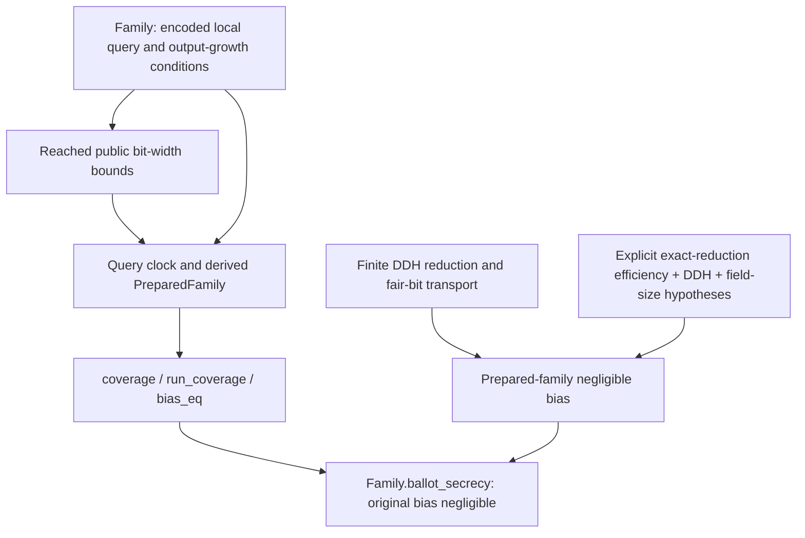
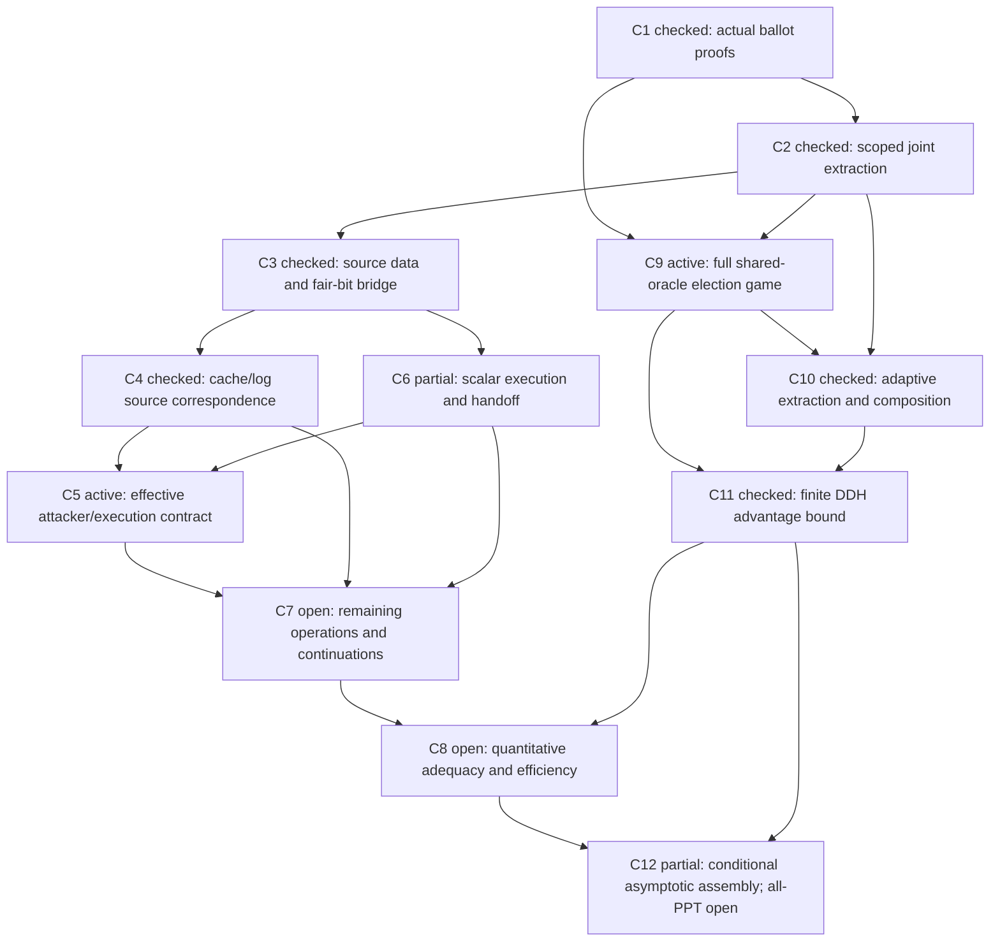
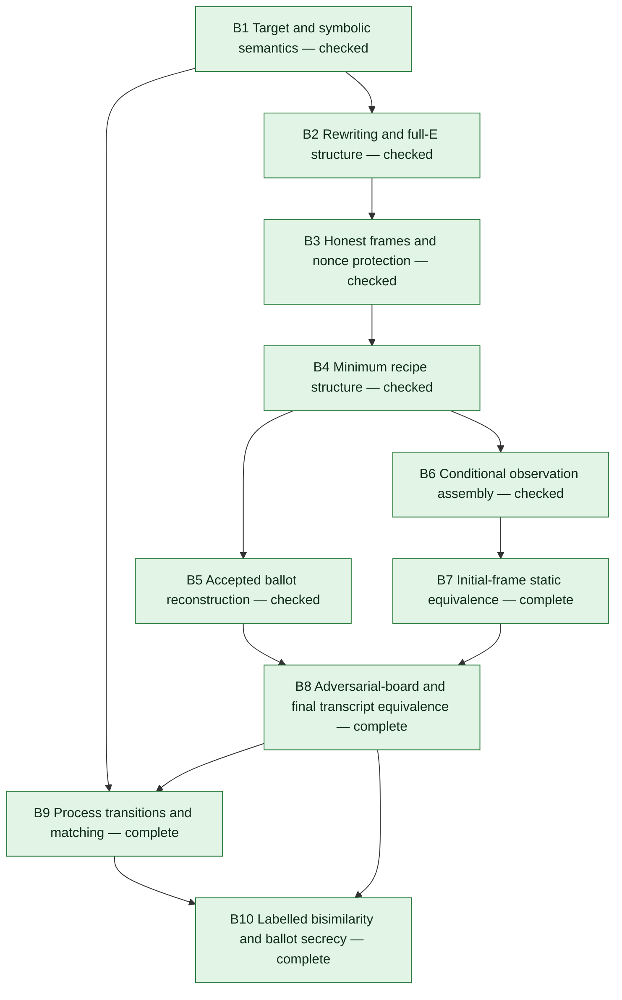

# Helios proof blueprint

This blueprint covers both the completed historical symbolic proof and the
completed scoped computational proof under the revised efficiency boundary. [task list.md](../../task%20list.md) remains
the only development backlog. This document records theorem dependencies,
evidence boundaries and the current frontier; acceptance criteria and task
checkboxes live in that task list. The symbolic B1–B10 count and computational
Step 1–3/C1–C12 counts are separate. None measures effort remaining.

The [mathematical reference](../formal-reference/main.pdf) (2026-09-15) provides
the reader-facing navigation layer: protocol, attacks, documented repair,
security contract, proof dependencies and exact Lean anchors. Its
[claim ledger](../formal-reference/claim-ledger.md) and
[build instructions](../formal-reference/README.md) record the presentation
boundary and checks. The reference and its typed interface restatements add no
new protocol theorem or premise; the B1–B10 endpoint below remains unchanged.
Supporting historical components are in the separate
[development catalogue](../formal-reference/catalogue.pdf), built and checked
independently from the concise reference.

Computational position: **3/3 proof milestones complete under the revised
boundary; publication package complete**. The endpoint is
`ElectionSecurityFamily.Family.ballot_secrecy`. Library selection and the shared
Lean 4.33.1 toolchain are supporting prerequisites, not secrecy milestones.

The [retained-root manifest](../../ExplainableCrypto/Helios/Computational.lean)
and [optional aggregate](../../ExplainableCrypto/Helios/Execution.lean) separate
build navigation without changing this proof dependency map.

## Computational proof dependencies

| Layer | Final evidence / boundary |
| --- | --- |
| C1–C4: algorithms, attack and repair | Checked concrete attack and repair/correctness for the fixed two-candidate, three-voter game. |
| C10–C11: finite reduction | Exact original-game bias bound, simulation/rejection/extraction losses and fair-bit sampling transport. |
| Attacker coverage (former C5 semantic gap; C12) | `ElectionPublicEncoding` and `Family.prefix_input_bounded` / `result_input_bounded` bound actual serialized observations. `QueryClock` derives global caps. `Family.coverage`, `run_coverage` and `bias_eq` preserve the original game and cache. |
| C12: scoped asymptotic endpoint | `Family.ballot_secrecy` checks negligible original bias with all `Family` conditions, inverse-field-size negligibility, two exact normalized-reduction efficiency hypotheses and the same-representation fair-coin DDH assumption. |
| C5–C8: fully mechanized implementation efficiency | Deferred, not completed. Primitive TM certificates and partial caller/compiler machinery remain checked in the optional `HeliosExecution` target; machine definitions required by the theorem stay in the default build. They support parts of the external efficiency argument; full machine correspondence/cost is not claimed. |
| C9: historical attack transport | Separate validation item; not a hypothesis of the secrecy bound and not a publication blocker. |



The [closing audit](helios-computational-closing-audit.md) enumerates every
load-bearing assumption. The strict-PPT interpretation of `Family` and exact
normalized-reduction implementation/runtime are external arguments, assessed by
readers. The Lean theorem supplies source coverage for the resource interface;
it does not establish a standard-machine characterization of PPT. Its source
bounds cover all typed replies, including inconsistent hash replies. A consistent-
oracle-only runtime claim needs an external clock-normal-form argument.

The [scope comparison](helios-scope-comparison.md) documents two separately scoped
models of the historical protocol; no symbolic/computational correspondence has
been proved. The [experience report](helios-development-experience.md) records
the deferred route and library findings. The publication package is complete;
no new proof-development or transfer goal is active.

<details>
<summary>Historical computational component evidence (superseded tracking view)</summary>

The following records preserve the earlier fully mechanized efficiency route.
Their “current”, “open”, “active” and 2/3 checkpoint language describes that
historical target. It is not the current backlog or the revised proof boundary;
use the dependency map above and section 4 of task list.md for current status.

Computational milestone position: **2/3 complete; Step 3 (ballot secrecy) active**.
The attack and repair/correctness stages are integrated and audited. Library
selection and toolchain migration are complete supporting prerequisites.
The milestone count does not estimate effort remaining.

The second-ciphertext/four-draw continuation now passes complete targeted checks.
`PrimeRemainingProgramSource.continuation_run` exposes the original p1/pt
requests and state threading. `PrimeSecondTranscriptSource.source_presentation`
derives the second-call inputs and frame; `PrimeSecondTranscriptMachine.charged`
and its source specialization derive actual execution and cost. The complete
`PrimeSecondTranscriptCaller.execution_source`/`.physical_run` retain the original
raw source, first proof, nonce pair and updated saved state. Native mutation and
typed endpoint controls, root build, complete audits and reviewed reference
§14.126/Theorems 14.151–14.153 (pages 168–170) pass; this prefix is integrated/audited. Subsequent commitment results below advance this prefix; programming and return,
the overall proof and later election execution remain open. C6 stays partial.

The first p1 commitment now passes targeted source, execution and raw-caller
checks. `PrimeSecondCommitSource` derives every input, bound and retained frame;
`PrimeSecondCommitMachine.charged_source` reuses the unchanged numeric controller.
`PrimeSecondCommitCaller.execution_source`/`.physical_run` connects the original
raw input to the new coordinate, preserving all previous words and the same
fair-bit source tree. Native mutation and independent typed controls pass.
Root build, complete audits, checker tests and reviewed reference §14.127/
Theorem14.154 (pages170–172) pass; this increment is integrated/audited. The following continuation supplies the other three coordinates; programming/
return and later election execution remain open.
The remaining p1 commitment continuation now passes its source, resident-run
and raw-caller checks. `PrimeSecondCommitTail.charged_source` chains B, canonical
challenge difference, adjusted beta, C and D, deriving each return and total
charge from existing numeric controllers. `PrimeSecondAllCommitCaller.execution_source`
and `.physical_run` derive the original raw fair-bit source tree and physical
bound, retaining the first proof, both nonces and current saved state. All five
component instruction gates and independent typed controls pass; the root build
and complete audits, checker tests and reviewed §14.128/Theorem14.155
(pages172–173) pass; this increment is integrated/audited. Next: p1 key
serialization, current-state programming and proof return, then the overall
proof and later election execution. No checkpoint closes at this boundary.

The p1 key serialization now passes targeted source, resident execution and
original-raw/physical checks. `PrimeSecondKeyMachine.charged_source` derives
actual digits/work/widths under a fixed frame of the existing serializer;
`PrimeSecondKeyCaller.execution_source` retains the original draw tree and all
old70 words while writing the original flat key. Its `.physical_run` derives
total cost. The7/9/1 native gate and independent full-state controls pass.
Root build and complete integration/reference review pass.
`PrimeSecondProgramSource` derives the next programming inputs and growth bounds
from the resident updated state, with current counts≤N+1 and semantic successor
counts≤N+2. These are source facts; its insertion,
history and proof-return execution remain open. No checkpoint closes.

## Bounded execution architecture assessment

The bounded assessment has a checked two-call test and an evidence-based
architecture decision; the increment is integrated/audited. Computational
secrecy remains open. The sole backlog and unchanged acceptance conditions are in C6 of
[task list.md](../../task%20list.md).

The complete resident request has checked execution, exact fair-bit source law,
original proof/state outputs and derived charge for every typed nonce, including
zero. The actual reentry routine and both historical source/frame presentations
also check. The combined raw controller uses that same request code twice;
its independent zero-sum full-state test detects a broken total return and an
omitted p1 state update. Its general combined run/source/cost theorem now checks.
The root build, complete audits, independent controls and reviewed PDF pass.

| Checkpoint | Demonstrated route | Remaining evidence needed |
| --- | --- | --- |
| C5 | Finite native three-tape oracle semantics; deterministic single-tape compilation and physical loading. | The fixed adaptive compiler experiment below checks preserved work and exact query-tree/cost correspondence. General native command coverage, startup conventions and normalization covering every intended standard-PPT attacker remain architectural uncertainties. |
| C6 | The combined raw p1/total source, reentry, full state, charge and physical execution are checked using the same complete request executor. | The remaining election continuation and effective adaptive caller with derived combined cost. No additional per-coordinate request implementation is needed. |
| C7 | Actual modular arithmetic, encryption, commitments, codecs and state updates with costs. | Executed remaining verification/rejection, board, key/trustee and saved replay operations from their source inputs. Primitive reuse is demonstrated; complete operations are unproved. |
| C8 | Exact main/rejection reductions and polynomial query/replay-count bounds. | Local runtime of those exact reductions, including snapshots, storage and all branches for every fixed accuracy degree. This is an architectural uncertainty. |
| C9 | Fixed historical game, explicit observations and instrumentation erasure. | Intended election-policy/family coverage and remaining historical control transport without restricting attackers or changing observations. |
| C12 | Conditional negligible-advantage theorem with sampling and field-size losses. | Derive its exact main/rejection hardness premises from DDH using actual efficient reductions and intended attacker coverage. |

The proposed (unproved) checkpoint endpoints remain
`NativeOracleCompile.local_step/query_run/answer_run/run/within` for C5,
`ElectionSecrecyEfficiency.main_ppt` and `.rejection_ppt` for C8, and
`ElectionSecurityFamily.coverage` / `ElectionSecrecy.prepared_ballot_secrecy`
for intended family coverage and C12. These names describe missing declarations;
the existing `ElectionSecrecyFairBits.prepared_negligible_of_fair_bits` is a
checked conditional theorem with exact main/rejection hardness premises.
The two-call proof now provides
`PrimeRemainingProofCaller.execution_source` and `.run_support`, with combined
clock/cost derived from the original raw input. `.physical_run` supplies the
existing bounded-adapter physical execution law.
`PrimeRemainingProofSource.source_run` and `.endpoint_outputs` connect the two
original requests to the returned proof triple and current saved state. Execution
stops before the explicit
`PrimeRemainingProgramSource.afterAliceProofs` continuation: Alice verification/
submission, Bob construction, attacker execution and final submission.

The evidence supports provisionally retaining the finite-machine representation
and shared resident executor for this concrete route. Full architecture
feasibility remains unestablished. The combined controller contains two fixed
framed copies of the same code definition; it does not implement a general call
stack or a single shared physical instruction block. It removes repeated
arithmetic, commitment, programming
and output proofs inside a request. Source presentations, return linking and
successor bounds still require explicit proofs.

A narrowly scoped alternative to the repeated raw wrappers is already present:
keep current state resident and frame one complete executor. A universal compiler
for unrestricted host `OracleComp` callbacks is not justified: zero-query host
computation can still be arbitrarily expensive or ineffective. No new language,
framework migration or arithmetic backend is required by the inspected obstacle.

For the fixed two-call test, bounding next tape height by current height plus
paid execution cost is sufficient. Iterating such a polynomial bound over
polynomially many calls can grow superpolynomially. C8 therefore needs structural
cache/history/snapshot growth from input widths and actual query/replay counts;
`PrimeProofRequest.next_counts`, `.next_outputBound`, `.next_inputSize` and
`CacheRequestPrefixes.requestBound_polynomial` provide relevant checked pieces.
The two-call result cannot stand in for that argument.

The assessment identified native adaptive compilation and actual replay-loop
storage/runtime bounds as the next architectural uncertainties. The separately
authorized experiment below addresses one fixed adaptive native program. Full
attacker coverage and the replay-loop bound remain unresolved.

## Bounded native oracle compilation experiment

The 90-minute experiment (2026-09-15, 03:24:38–04:54:38 UTC) has a checked positive
result for its fixed program. The root build, complete audits, independent controls and reviewed reference
§14.132/Theorems 14.161–14.162 pass; the increment is integrated/audited. It does not close C5 or authorize further protocol
construction. The fixed native table hashes the input, branches on the reply's
first cell, reads a coin, writes a dependent query and hashes again, preserving
independent private work.

`NativeWordCompiler.code` generates finite target code from that native table.
`NativeAdaptiveRun.exact_run` derives its full 19-step run, final six stacks,
halt/memory state and exact accumulated charge. `.native_correspondence` proves
identity of the complete query tree and native terminal tapes with the eight-step
source run, for arbitrary reply words. `NativeAdaptiveCost.within` derives a
uniform bound under the explicit reply-size limit; `.physical_run` transfers it
through the existing primitive compiler at its derived clock. None takes a
caller-supplied correspondence, frame or cost certificate.

The interface starts from resident dense bit stacks. Query writes establish the
cells needed by subsequent moves; the fixed path derives the empty answer-left
frame before each replacement. Full private words and the complete final answer survive; both replies are
arbitrary, and the coin intentionally replaces the first reply.
`NativeWordCompilerBoundary` retains native blank-write and blank-move examples
that the restricted compiler explicitly rejects. A general native compiler,
external startup packing/loading and intended standard-PPT coverage remain open.
The exact `NativeOracleCompile` endpoints named above remain proposed general
obligations; this fixed result does not discharge them.

The experiment provides concrete evidence for retaining existing execution
machinery on this boundary. It gives no theorem or effort estimate for the
remaining general coverage and C8 reduction-runtime obligations. Stop at the
bounded result; task list.md remains the sole backlog.

## General native query export

The next bounded experiment closes the general query-extraction component of
C5: `NativeQueryExportFrame.charged` executes from arbitrary finite encoded
before/after cells, the actual current-head register and arbitrary private words.
`.native_result` identifies exactly `OracleTapeDispatch.readWord`;
`.native_storage` and `.private_retained` identify both original tape halves,
restored head and scratch, and every private word. Internal blanks terminate
the query while all postblank data is retained. Source clock `2*after.length+6`
and charge at most `12*after.length+36` are derived from actual instructions.
The head preparation and restoration are executed, not input assumptions.

Dependencies reused: existing cell encoding, TM2 return linking, preserving
stack frames and source instruction-cost induction. The new decoder bridge
uses the existing native `readWord` definition. Independent core and actual-head
campaigns each pass 1,522 originals with five/seven actual instruction mutations,
plus thirteen kernel controls. Root build, complete audits, both gates and reviewed reference
§14.133/Theorem 14.163 pass; this increment is integrated/audited. The round-trip
experiment below addresses one-call reply import/dispatch/successor composition.
External packing, intended PPT coverage and C8 reduction runtime remain open. The earlier dense
compiler counterexamples remain valid. Stop construction at this result; C5
stays partial, with 2/3 main milestones and 6/12 checkpoints complete.

## General native oracle round trip

The completed bounded experiment (authorized 2026-09-15, 09:23:15–10:53:15 UTC) composes the
checked exporter with an actual native hash or coin event, complete answer
replacement, and return to the original selected continuation. Targeted
`NativeAnswerImport.run`/`.charged`, the full deterministic frame interfaces,
`NativeRoundTrip.native_call`/`.oracle_step` and `.execution_cost` pass.
`NativeRoundTrip.execution_correspondence` and `.native_correspondence` also
check the full actual event tree and represented native successor.
`.framed_correspondence` and `.framed_cost` preserve arbitrary private words with
the same derived charge. Root build, complete audits and reviewed reference §14.134 pass.

Input is resident canonical encoding of arbitrary finite optional-Boolean cells,
with original head registers and empty query-export scratch. Internal blanks
terminate the emitted query without deleting its later storage. Hash replies
use the existing length limit; both actual coins remain. The event overwrites
the old answer-right word, executed loops clear its old left word and raw query,
and the existing converter creates the new native head/right representation.
The observer stops on the selected live return before executing its next command.
The derived `callCost` includes both old answer halves and reply conversion.

Dependencies: `BitTapeCoverage`, the general exporter, `BitTapeInput`, stack and
memory frames, return linking, and actual source instruction costs. The operation
has no ballot/group assumptions and could serve the native oracle interface's
one-call refinement. It does not supply arbitrary-program compilation, external
startup packing, a physical live-return theorem or full standard-PPT coverage.
The full-code gate and importer mutation controls pass; their finite scope is
recorded separately from the general proofs. C5 stays partial, with 2/3 main
milestones and 6/12 supporting checkpoints complete. Stop construction at this
bounded result; task list.md remains the sole backlog.

## Historical computational proof dependencies

**2/3 main milestones complete; Step 3 active. Within Step 3, 6/12 checkpoints
are complete (C1–C4, C10–C11). The bounded C6 architecture assessment is complete; C5/C6/C9 remain partial.**
The precise acceptance criteria are in the
[Step 3 tracking view](../../task%20list.md#computational-checkpoints-current-tracking-view).
A completed prerequisite does not imply full-election secrecy or efficiency.

| Checkpoint | Evidence status | Current boundary |
|---|---|---|
| C1: actual ballot-proof prerequisites | Integrated/audited | Completeness, special soundness and statistical simulation for the actual construction; full adaptive election use is discharged in C10. |
| C2: post-prefix joint extraction | Integrated/audited | All three witnesses for one supported accepted submission, consistency and explicit losses; the interaction scope is fixed. |
| C3: finite source data and fair-bit bridge | Integrated/audited | Original encoded data, support/size bounds and complete-output sampling-distance theorem; host arithmetic costs remain open. |
| C4: cache/log execution and handler correspondence | Integrated/audited | Actual routines and exact source query tree/output/state; host conversions/transfers/continuations are excluded. |
| C5: efficient attacker and execution contract | Partial tape correspondence; active | Finite raw-loop correspondence and bounded-handler transport checked; deterministic TM1 runs derive packing/growth and complete port-transfer costs. Actual tape-loop correspondence and polynomial common-clock transport are checked under source termination/charge and bounded-answer conditions. Primitive deterministic-region bounds and finite support are checked. Bounded finite primitive-loop refinement is checked. Complete target-control finiteness and primitive source-clock/handler transport are checked. Physical single-word initial loading and source-clock composition are checked. Local three-symbol TM0 computation is represented with derived costs. Raw input conversion and physical/native linking are checked. Three-tape native interface/frame agreement and one mechanically compiled adaptive native program are checked, with full source/state correspondence and derived physical cost. General preserving native query export now checks for arbitrary finite cell contents, with full storage restoration and derived source charge. One-call actual event/successor correspondence and derived live-return charge, including arbitrary private storage, now pass targeted checks. General compiler coverage, startup packing, actual scalar-handler policy and full intended standard-PPT coverage remain. |
| C6: scalar sampling and digit handoff | Partial | Complete serialized sampler/cache requests, original-source correspondence and request bounds are checked. The raw constructor executes both nonce draws, the first ciphertext and all four simulator scalar draws. All four first-ballot simulator commitment coordinates and the original full hash-key encoding have integrated/audited raw source/physical execution proofs with derived cost. State extraction is integrated/audited. Insertion, sticky-flag cleanup, ordered history and combined resident/raw programming execution are integrated/audited with the root build, complete audits and reviewed §14.124. The first returned-proof encoding and updated-state repacking are integrated/audited in §14.125, with original raw-source and physical-cost correspondence. The resident second ciphertext and four fresh transcript draws have integrated/audited raw-source execution and physical cost in §14.126. The first p1 commitment now has integrated/audited resident and raw-source execution with derived physical cost in §14.127. The remaining coordinates, canonical difference and adjusted beta now pass resident/raw execution and cost checks in §14.128; the root build, complete audits and reviewed reference pass. Key serialization and the generic complete resident request now have checked execution/cost; reentry and both historical source frames check. The combined raw controller passes a bounded native test; its general two-call source/halt/cost and physical execution now check. Actual remaining continuations and combined adaptive cost remain open. |
| C7: remaining arithmetic and saved-context execution | Partial execution | Executed complement preparation, modular addition/multiplication/power, first ciphertext, canonical challenge difference, adjusted ciphertext and all simulator commitment coordinates have full-state/cost proofs. Nested statement/history construction and actual raw-source programming now are integrated/audited with the root build, complete audits and reviewed §14.124. The first returned-proof and updated saved-state encodings now have integrated/audited execution in §14.125. The retained second-nonce routing/encryption and fresh draws now are integrated/audited in §14.126. Later nonce/scalar arithmetic, complete subsequent proof requests and election continuation execution remain open. |
| C8: quantitative adequacy and efficiency | Open | Standard machine interpretation and polynomial costs for the final protocol/simulator/extractor/reduction, with explicit sampling loss. |
| C9: shared-oracle full-election game | Partial; active | Shared proof oracle and sampled-game correspondence are checked; preparation retains its cache through the election. Known repair rejection now transfers to the actual oracle from any cache; historical positive-attack transport and general security policy remain. Programmed-source extraction is checked in C10. |
| C10: full adaptive simulation/extraction | Integrated/audited finite obligation | Actual source reconstruction, simultaneous witnesses, fixed-original repetition, finishing, real/random rejection, effective parameters and full advantage composition checked. Pure-operation/PPT costs remain C8. |
| C11: complete secrecy game reduction | Integrated/audited finite obligation | Original prepared-game bias bounded by two actual DDH advantages plus 18/(q−1)+3L+2/e; matching prime-field query cost. Negligibility and standard-PPT execution remain C12/C8. |
| C12: parameterized all-PPT endpoint | Partial conditional prototype | Actual prepared-family negligibility follows from exact DDH-security premises, with polynomial accuracy and derived field-size/replay bounds. Probability-law sampling transport to the exact fair-bit reductions is checked. Discharging their security premises through standard-PPT execution and intended family/corruption/election scope remains open. |

`CacheHashDispatch.request_run` now closes the loaded request's general
composition: complete raw query tree, all final ports, derived halt and combined
charge for every typed finite cache/key/log. The probe supplies both miss
workspace/freshness and bounded hit scratch. `.within` and `.physical_run`
derive the existing primitive compiler's contract and loaded-request execution;
`.execution_source` matches the existing adaptive caller's request observation.
Seven kernel controls and 324 directed native fixtures pass, detecting three
actual-code mutations. Root build, exact-name axiom audit, symbolic/reference checks and reviewed
§14.105/Theorems 14.108–14.109 (pages 132–134) pass; this loaded-request
component is integrated/audited.
`CacheRequestInput.load_request` now derives the complete loaded workspace from
one canonical four-field input. `CacheRequestMachine.request_run` executes the
success guard and complete request, preserving its raw query tree and deriving
halt/charge; `.physical_run` includes actual blank-work input loading.
Loaded-width bounds include the ambient public group width, private sampler
record and log count-header growth. Root build, exact-name standard-axiom audit,
symbolic/reference checks, eleven kernel controls and native mutation gates pass.
Reviewed §14.106/Theorems 14.110–14.112 (pages 134–136) is synchronized; this
per-request increment is integrated/audited.
The polynomial-family and supported-prefix results are integrated/audited:
`CacheRequestPrefixes.supported_lift` lifts original executions; `.query_run`,
`.events_retained` and `.prestates_bound` capture and bound original requests,
including hits and uniforms. `.request_clock_bound` and
`.hash_request_execution_bound` connect these states to the actual request;
`.repaired_source_request_clock_bound` supplies the historical `n+15` budget.
`.requestBound_polynomial` derives the family bound, including codec headers.
Root build, exact-name standard-axiom audit, symbolic/reference gates and
reviewed §14.107/Theorems 14.113–14.114 (pages 136–138) pass.
`CacheCallerMachine.load_request` and `.request_run` are integrated/audited
for resident entry, the original request and guarded return with an unchanged
saved word. `.execution_source`, `.source_clock_bound`, `.within` and
`.physical_run` connect the full observation, source budgets and actual primitive
execution cost. Native mutation gates, nine kernel controls, root build, full
standard-axiom audit, symbolic/reference gates and reviewed §14.108/Theorems
14.115–14.116 (pages 138–140) pass.
C6 remains partial: actual source production of canonical operands and saved
contexts, decoding/continuations and combined adaptive cost remain.
The nonce sampler's `primeNonceValue` successor now checks in
`PrimeNonceMachine.successor_run`, with complete saved-state preservation and
`.charged` deriving the executed cost. Root build, six kernel controls and the
1,024-case native mutation gate pass; full standard-axiom audit and reviewed reference §14.109/Theorem 14.117 (pages 140–141) pass; this successor component is integrated/audited.
`PrimeNonceMachine.sample_source` now checks the complete public-input nonce
sampler, including executed q−1 preparation and correct width, full state,
saved data and combined charge. `.sample_execution_source` matches the exact
historical fair-bit tree; `.sample_loss` retains its one-draw statistical loss.
`.sample_within`/`.sample_physical_run` derive the physical bound from resident
input/frame. Native and kernel controls pass; root build, full standard-axiom audit and reviewed reference §14.110/Theorems 14.118–14.119 (pages 141–143) pass; this complete single-nonce component is integrated/audited.
The following increment closes nonce-pair invocation/storage; subsequent
honest-ballot construction remains open. C6 closure still needs C7 group/scalar arithmetic
and C5's effective attacker interface. The sole backlog records these obligations;
no compiler for arbitrary host continuations is assumed.

The actual nonce-pair caller now checks in `PrimeNoncePairMachine.pair_run` and
`.pair_execution_source`: executed copies, clean reentry, two successive draws,
both saved results and the exact historical joint source tree. `.pair_loss`
retains the two-draw bound; `.pair_physical_run` derives complete cost from the
resident record/context. Native and kernel controls pass; root build, full standard-axiom audit and reviewed reference
§14.111/Theorems 14.120–14.121 (pages 143–145) pass. This pair increment is
integrated/audited. Loaded modular multiplication now checks in
`BinaryModMultiply.run`, `.group_coordinates` and `.physical_run`, including
executed complement preparation, the complete bit loop, retained operands and
workspace cleanup. The physical contract and width-based cost are derived.
Native/kernel controls, root build, full standard-axiom audit and reviewed
reference §14.112/Theorems 14.122–14.123 (pages 145–147) pass. This multiplier
increment is integrated/audited. Loaded square-and-multiply now checks in `BinaryModPower.run`,
`.group_coordinates` and `.physical_run`. Its original exponent/context,
complete clean state and bounds are derived from execution. Native/kernel controls, root build, full standard-axiom audit and reviewed
reference §14.113/Theorems 14.124–14.125 (pages 147–149) pass; this power
component is integrated/audited.
`PrimeEncryptMachine.run` now checks the two power calls, first-coordinate
storage and vote-dependent multiplication, with derived full state and cost.
`.source` matches actual `encryptWith`; `.physical_run` derives the primitive
execution bound. Its 210-case native gate and nine full-state kernel controls
pass. Root build, full standard-axiom audit and reviewed reference
§14.114/Theorems 14.126–14.127 (pages 149–150) pass; this loaded
ciphertext component is integrated/audited. The smallest next caller obligation
is actual public-parameter and nonce-pair-output routing into this loaded
ciphertext interface. Constructor input routing, proof-request encoding, C5's effective
attacker interface and complete adaptive execution/cost remain open. C6/C7
remain partial.

The first-nonce route controller now has nine checked kernel controls and
matching 810-case native/direct-kernel validation with six detected instruction
mutations. Its general complete-state run and charge theorem now pass targeted
module builds, including the q−1-wide scalar bound and padding only after halt.
The combined pair/routing/encryption controller now has a general joint
execution, aggregate charge and exact historical source-law proof, with targeted
module builds and ten independent controls checked. The same 60-case kernel
gate passes; its per-fixture checks omit aggregate charge, which the general
run derives. The redundant interpreter campaign was deliberately interrupted.
These components are integrated in the raw-input prefix below.

The current source-input decision uses the actual constructor arguments:
`repairedSubmissionPrimeSourceOracle` and `repairedSubmissionWithNoncePairs`
take g/pk/vote directly. The initializer uses the existing ciphertext-pair
codec for (g,pk), with explicit p, sampler record and private vote/saved data.
Its complete-state run and charge now pass targeted module builds. Existing
field/prefix/copy routines derive every input origin and the clock
14*N²+54*N+83; no successful-initialization premise is supplied. The independent
gate passes 28 canonical cases, malformed rejections and mutation controls.
Parsing larger public parameters would not prove key generation.

The outer `.linked_run` and `.charged` now pass targeted production builds;
`.execution_source`, `.within`, `.start_height` and raw `.physical_run` pass
the root build. The latter derives startup≤4*N+8 and physical time from
loaded source-stack height N and combined charge B. The complete standard-axiom
audit, symbolic/reference gates and compiled, visually reviewed reference
§14.115/Theorems 14.128–14.129 (pages 151–152) pass. This prefix is integrated/audited. The independent outer gate passes 12 full-state cases and five
mutations. This is the first honest ciphertext prefix, not full C6.

The active continuation executes `ballotFiniteProgrammedImpl`'s four full-field
simulator draws c,e,z0,z1, followed later by commitments and `.program`. The
local `PrimeHonestTranscriptMachine.charged`, `.execution_source` and `.within`
pass targeted production builds. `TranscriptScalarSave`'s actual consuming
save, modulus clearing, bounded padding and derived charge also check. The
four-tuple source factors the existing `ballotFullSimTranscript` definition;
this factor alone does not execute commitments.

The four-draw gate passes eight full-state cases and four actual mutations.
The first-draw native campaign passes separately; its earlier kernel resource
failure remains unpassed and recorded. `PrimeTranscriptDraws.charged`,
`.execution_source` and `.within` now check with all phase/frame/width/cost
premises derived. `PrimeHonestTranscriptCaller.linked_run`, `.execution_source`,
`.within` and `.physical_run` check from original raw input through both nonce
samples, first ciphertext and all four simulator draws. Complete input origins,
query order and the summed actual charge follow from reached executions.
The root build, exact-name computational audit and symbolic/reference checks
pass. Compiled reference §14.116/Theorems14.130–14.131 (pages152–154) is
visually reviewed. The smaller raw campaign passes both votes/coin orders and
two actual mutations at p3/q2. Its singleton nonce space does not test distinct
nonce values; larger reached-state cases remain in the separate four-draw gate.
The larger raw q11 host-timeout attempt stays unpassed, with no returned
mismatch. This prefix is integrated/audited and does not close C6.
The first `ballotSimCommit` coordinate is now also integrated/audited:
`PrimeSimCommitMachine.run`/`.charged` execute the complete local chain, and
`.source`/`.charged_source` derive the exact subgroup coordinate from reached
operands. `PrimeSimCommitCaller.linked_run`, `.execution_source`, `.within`
and `.physical_run` connect the original raw input, full tree/state and
combined cost. Root build, full audits and reviewed §14.117/Theorems14.132–14.133
(pages154–156) pass. Local/raw mutation gates and kernel controls retain the
zero/non-subgroup distinction and actual instruction defects. The exponent is
q−e, including q at zero; all15 appended private work ports return empty.
The second zero-branch coordinate z0·pk−e·beta is also integrated/audited.
`PrimeSimCommitSecondMachine.charged_source` reuses the unchanged numeric
program under a fixed frame; actual source operands and every retained word
are derived. `PrimeSimCommitPairCaller.linked_run`, `.execution_source`,
`.within` and `.physical_run` connect both coordinates to original raw input,
with the new combined code's own compiler factor. Local/raw mutation gates,
root build, complete standard-axiom audits and reviewed §14.118/Theorem14.134
(pages156–157) pass. The raw q2 fixture retains its singleton-nonce limitation.
Canonical c−e now executes, including the separately proved e=0 path of the
unchanged modular-addition controller. The false claim q−e<q at zero remains
refuted. ScalarDifferenceMachine copies/parses both prefixes, subtracts, writes
U(d) and clears work; PrimeSimDifferenceCaller derives its full raw source and
physical bound. Its raw gate passes at600s host allowance after a retained300s
resource timeout, with unchanged modeled clocks/costs.
PrimeAdjustedBetaMachine derives actual beta−g from reached g/beta/p/(q−1)
using one existing power/product with fixed frames and no operand copies.
PrimeSimOneFirstMachine/PrimeSimOneSecondMachine then reuse the original
numeric controller for the actual remaining coordinates, retaining all earlier
results. Their source/frame/charge proofs and independent mutation gates pass.
PrimeSimOneTail derives complete finite returns and actual charge;
PrimeSimAllCommitCaller.linked_run, .execution_source, .source_commitments,
.within and .physical_run connect original raw input to all four actual
commitment coordinates and full final state. Independent complete43-state
controls pass. Root build, complete axiom and document audits, checker tests and the reviewed PDF pass; this increment is integrated/audited.
PrimeSimKeyMachine now executes the original flat eight-field hash-key codec;
its source, full-state controls and actual instruction gates pass. PrimeSimKeyCaller
derives original raw-source correspondence and total physical execution. Root
build, complete audits, checker tests and reviewed §14.122 pass; this increment
is integrated/audited. The next state-reconstruction experiment has targeted
checked exact first-request semantic origin for arbitrary finite shadow/live
states, and typed raw/context/work presentation. The extraction machine's complete run, local quadratic bound and actual raw
caller source/physical correspondence pass the root build and full audits.
The reference §14.123 records the source origin, extraction and occupied-work
counterexample. This closes the local extraction sub-obligation; C6 remains
partial. The next programming components now have targeted checks:
PrimeProgrammedInsertInputMachine copies shadow44 to23 and clears44;
CacheProgrammedInsertMachine executes collision capture and occupied-work
cleanup; PrimeProgrammedHistoryMachine constructs the nested statement and
prepends it, preserving order and duplicates. Their source interfaces derive
all canonical operands and workspace from the actual post-extraction/insertion
states and identify the original state.program cache/flag/history successor.
PrimeProgramMachine.charged_source and PrimeProgramCaller.linked_run,
.execution_source, .source_state, .within and .physical_run now pass targeted
checks for the combined update and original raw source. The root build,
complete audits, checker tests and reviewed §14.124/Theorems 14.145–14.147
pass; this increment is integrated/audited. These components preserve the separate live cache and original raw
context with the pre-update saved state. PrimeProgramOutputMachine.run and
.charged now execute the original returned-proof and updated-state codecs;
PrimeProgramProofSource and PrimeProgramRepackSource derive all fields, blank
work and enlarged record bounds. saved_changed excludes every stale saved
record, including occupied keys. PrimeProgramOutputMachine.charged_source and
PrimeProgramOutputCaller.linked_run, .execution_source and .physical_run pass
targeted checks from the original raw source. They produce proof48/saved49,
retain all preceding 48 words and use the unchanged fair-bit draw tree, with
derived total physical cost. Independent native and kernel controls, the root build, complete standard-axiom
and symbolic/reference audits, checker tests and reviewed §14.125 pass.
This output increment is integrated/audited; no checkpoint closes. The next operator
frontier is the actual resident p1/pt continuation, retaining the nonce pair and
p0 and allowing the nonce sum to be zero. Reentering the full prefix would
resample and repeat p0. Later ballot/verification/attacker continuations still
need execution and adaptive cost proofs. Arbitrary saved bytes are not a state
certificate; an empty-state specialization does not close general reachable
successor-state coverage.
Whole-election key generation,
remaining constructor and effective attacker integration stay open. The sole
backlog is the existing C6/C7 task-list items.

The execution layer now has an actual primitive oracle loop, reusing Mathlib's
pinned compilers and the existing physical oracle I/O. Target control is proved
finite throughout execution; reconstruction retains every non-tape field.
`BitOraclePrimitiveBounded.run_source_bounded` / `.run_source_handler` preserve
complete caller results, native queries and lawful handler effects at clock
650*G*B*(H+B+V+1)^2. The original source halt/charge and bounded-answer contract
remain explicit; compiler correspondence and intermediate halt are derived.
The adaptive canary derives its own source bound.

This increment is integrated/audited: root build, exact-name standard-axiom
audit, eight new controls and reviewed reference §14.89/Theorem 14.91 (page 115)
pass. Earlier execution layers and independent fixtures are recorded in the
[results ledger](helios-results.md).

Physical initial loading now checks in `BitOracleInitialInput.load`: blank
working storage reaches the complete canonical ready state within 4|input|+8
steps. Its source-clock/handler theorem composes this startup with the primitive
loop. Input bits, including malformed encodings, are loaded unchanged; parsing
and operand distribution remain source work. Root build, exact-name axiom audit,
six controls and reviewed reference §14.90/Theorem 14.92 (page 116) pass; this
increment is integrated/audited.

`BitTapeCoverage` now supplies the local-computation component of that coverage:
ordinary blank/false/true tape transitions run in the existing source language,
with derived charge at most seven per native step and a connection to the
primitive compiler. Native oracle I/O remains open;
this is not full attacker coverage. Root build, exact-name axiom audit, six
controls and reviewed §14.91/Theorem 14.93 (page 117) pass; this local component
is integrated/audited.

Raw input conversion and its link to native execution now check in
`BitTapeStart.physical_run`. Starting from blank work storage, it derives the
complete native result and a polynomial clock from input length and the native
halt bound. Seven controls include actual physical/primitive execution; source
conversion and correspondence are derived. Root build, exact-name axiom audit
and reviewed §14.92/Theorem 14.94 (page 118) pass; this connection is
integrated/audited.

`NativeOracleTape` fixes the remaining three-tape reference interface. Its
native events agree with the existing dispatcher and preserve full work/query
tapes for every reply. Six controls include a private-frame counterexample to
work/answer aliasing. This is interface agreement; its source compiler and full
attacker coverage remain open. Root build, exact-name standard-axiom audit and the reviewed reference
§14.93/Theorem 14.95 (pages 118–119) pass; this interface agreement is integrated/audited.

The conditional completion prototype now checks in
`ElectionSecrecyPrototype.prepared_negligible_of_ddh`. It derives negligible
bias for the original prepared-election family from polynomial hash-query
budgets, negligible reciprocal field size, and DDH security of the two exact
reductions. For every fixed degree k it uses e(n)=(n+1)^(k+1); the eventual
field-size condition and a polynomial bound on actual replay counts are derived.
This does not establish local runtime, sampler/standard-PPT correspondence or
DDH security of those reductions. A checked counterexample shows that fixed
linear extraction accuracy is not negligible. Four controls and 3,000 independent
arithmetic fixtures, root build, exact-name standard-axiom audit and reviewed
reference §14.94/Theorem 14.96 (pages 119–120; theorem page 120) pass. The
conditional prototype is integrated/audited.

Sampling transport now checks in
`ElectionSecrecyFairBits.prepared_negligible_of_fair_bits`: the original
prepared-election bias is negligible under security of the exact fair-bit main
and rejection DDH reductions. Their complete query bounds and negligible
sampling losses in both DDH worlds are derived from polynomial callback
budgets. The challenger distributions remain exact. Five controls and 750
independent finite DDH enumerations, root build, exact-name standard-axiom audit
and reviewed reference §14.95/Theorem 14.97 (pages 120–121; theorem page 121)
pass; this increment is integrated/audited. This closes
probability-law sampling composition, not effective modulo/group operations or
standard-PPT efficiency. Next: complete C6's scalar execution and cost, needed
to justify the fair-bit reductions' remaining runtime premises.

`BinaryModuloMachine.run` now executes complete binary division on a loaded
little-endian word and positive canonical modulus. It returns canonical remainder
digits, retains the modulus and clears input and scratch, within
N*(8*q.size+13)+2 TM2 ticks. The proof derives the remainder/width invariant and
counts input reversal, linked subtraction and both return-transfer passes.
Seven Lean controls, 16,352 exhaustive cases and 1,500 seeded cases pass;
root build, standard-axiom audit and reviewed reference §14.96/Theorem 14.98
(pages 121–122) pass. This closes C6's second acceptance condition;
connecting coin loading to division and scalar digit handoff remain.
`CoinWordLoader.run_source` now executes chronological coin loading with exact
source cost; `.word_index`/`.run_modulo` relate its numeric observation to the
original sampler. Five controls, root build, standard-axiom audit and reviewed
reference §14.97/Theorem 14.99 (page 123) pass. Width/modulus loading, linking
actual division stacks and scalar digit handoff remain open at that boundary.
`CoinModuloMachine.run_source` now links the actual coin loader to division in
one fixed program, preserving the complete oracle tree and full output frame,
with derived clock and charge. `.sampler_value` matches the original modulo
sampler. Five controls, 2,032 exhaustive/750 seeded cases, root build, exact-name
standard-axiom audit and reviewed reference §14.98/Theorem 14.100 (page 124) pass.
`ScalarWriteCode.run_digits`, `.from_sampler`, `.sampleWord_source` and
`.sampleWord_value` now check a two-phase writer handoff and exact encoding
observation, preserving all eight sampler stacks across entry-control resumption.
Six controls and independent fixtures pass. Root build, exact-name audit and reviewed reference §14.99/Theorem 14.101
(page 125) pass; this increment is integrated/audited. `CoinScalarMachine.run_eq` now compiles the two phases into one fixed program,
deriving source and continuation termination. `.run_source` and `.sampler_value`
retain the exact whole tree and charge. Six controls and 2,032 exhaustive/750
seeded fixtures, root build, exact-name audit and reviewed reference §14.100/
Theorem 14.102 (pages 125–126) pass. This increment is integrated/audited.
`CacheHashCoins.hash_hit`/`.hash_miss` now use the actual encoded sampler output
with existing cache/log routines. `.hash_source`/`.hash_distance` compare the full
output to the actual finite logged source with exact uniform sampling, with
one-request loss at most 2^-slack. Five controls and 576 independent fixtures
pass. Root build, exact-name audit and reviewed reference §14.101/Theorem 14.103
(pages 126–127) pass; this increment is integrated/audited. Complete caller
compilation, width/modulus preparation and combined execution cost remain open.
`CacheCallerCoins.run_eq` now derives full adaptive host-caller correspondence
with the original finite logged source under `runFairBitUniform`. `.source_bound`
derives its range-query budget from the original caller, and `.distance` retains
complete return/cache/log error B*2^-slack. Five controls and independent adaptive
fixtures pass. Root build, exact-name axiom audit and reviewed reference
§14.102/Theorem 14.104 (page 128) pass; this connection is integrated/audited.
Serialized preparation now checks in `SamplerOperands.run`/`.uniform_run`,
including original upper-bound increment, exact widths, suffix/private-frame
preservation and derived charge. `PreparedScalarMachine.run_source` links it to
sampling, `.within` discharges the existing compiler contract, and `.physical_run`
starts from raw input/blank work storage with a derived combined clock. The actual
adaptive caller uses the prepared program via `hashPrepared` and `sampleUpper`;
its full correspondence/error theorems still pass. Root build, exact-name axiom
audit and reviewed reference §14.103/Theorems 14.105–14.106 (pages 129–130) pass;
this sampler component is integrated/audited. The complete loaded request is now
proved by `CacheHashDispatch.request_run`, as described above. Host enclosing
record construction/transport/decoding and typed continuations remain explicit;
C6 is partial.
`BitOracleStackFrame.run` now preserves the charged query tree under a larger
workspace. `CacheHashMachine.sample_run` applies it after an executed copy from
retained operand port 11; key/cache/log stay on 8/9/10. `.sample_value` and
`CacheHashCoins.preparedHash_eq` connect this actual miss branch to the existing
adaptive caller. `CacheReadMachine.miss_run`/`.hit_run` expose complete post-states,
including the hit's residual suffix/counter. Kernel and independent controls pass;
root build, exact-name axiom audit and reviewed reference §14.104/Theorem 14.107
(pages 131–132) pass. This sampler branch is integrated/audited. The new full
loaded-request proof discharges its internal transfers, return connections and
physical cost. The enclosing caller boundary is stated above.

The immediate route is endpoint-first: discharge the exact DDH premises through
C5–C8 execution, sampling and efficiency, and C9 family/control integration.
Further low-level machine construction is deferred until its role in that
assembly is explicit. C12 now has a conditional asymptotic result; the all-PPT
secrecy milestone remains open. Counts remain 2/3 main and 6/12 supporting.



The C9 repaired-control transport is integrated/audited in
`ElectionOracle.repairedAttackWorld_rejected`, with exact original execution/
world correspondence, six Lean controls and 240 independent multiplicative
executions. The reviewed reference §14.75/Theorem 14.77 is on pages 100–101
(theorem page 100). This closes that control obligation, not the C9 checkpoint.

The supporting raw-port, tape and primitive-region results are retained in the
results ledger and reference §§14.76–14.88. The current integrated C5 execution
contract is §14.89/Theorem 14.91, with physical initial loading in
§14.90/Theorem 14.92 (page 116). The local native-tape coverage component is
§14.91/Theorem 14.93 (page 117), with physical input/native linking in
§14.92/Theorem 14.94 (page 118). Full attacker coverage remains open.
Earlier open finiteness/common-clock/loading
entries are historical boundaries, discharged by these results.

The graph shows proof dependencies, not a mandatory serial schedule. C5's
representation decision comes before substantial additional execution machinery;
its final adaptive-interaction check uses C6's scalar implementation. C9's game
integration can proceed independently of low-level arithmetic. C11 can establish
a concrete advantage inequality before C8 finishes its reduction-efficiency
proof; both must close before C12. No symbolic-to-computational transfer theorem
is assumed or pursued during these checkpoints.

### Evidence at the former computational frontier

C1 resolves to `BallotSigma` and `NonzeroSimulationBridge`. C2 resolves to
`PrimeReplayExtraction` (`repairedSubmissionPrimeBits_extract_eq`, `_valid`,
`_consistent`, `_le`) and `PrimeReplayCost`. C3 resolves to the original
codec/size modules and `FairBitSampler`, `FairBitUniformOracle`, `PrimeFairBits`.
C4 resolves to `CacheReadMachine.source_cache_run`,
`CacheInsertMachine.source_cache_run`, `LogAppendMachine.source_log_run` and
`CacheHashHandler.run_eq`. Their assumptions and independent controls are
recorded in the results ledger and formal reference. The root build and exact
1572-public-declaration computational axiom audit pass with standard axioms
only. The latest reviewed finite DDH reduction is §14.74, pages 98–100
(Theorem 14.76 on page 99). Counts are coverage checks only.

C9 now resolves to `ElectionOracle.world_function` / `.game_function`: the
actual sampled election equals the original fixed-hash game after interpreting
the attacker callbacks. `prefix_function` / `finish_function` retain complete
public records. `run_preparedGame` threads pre-election cache answers into the
protocol and later callbacks; `run_repeat` derives repeated-query consistency.
The new random interpretation covers the existing fixed schedule, with its
cache private. General challenge/corruption/election-family policy, oracle-aware
attack instances remain open. The full proof-simulation and programmed-source
extraction results below establish the current cryptographic correspondence;
DDH construction remains separate. `ElectionCache.liftBallot_run` now derives
the actual ballot runtime inside any full cache, with exact reconstruction.
`world_eq_samplePrefix` factors the original world and
`preparedPrefix_rejection_le` bounds honest rejection after arbitrary prior
queries by `9 * noncePointBound F`, with generator injectivity explicit. The
real-prefix cache/acceptance interface is checked.

C10 resolves to the actual historical source. `ElectionReplaySource.lower_run`
and `ElectionProgrammedSource.prepared_runtime_eq` establish runtime/cache
correspondence; `ElectionDDHSource.prefix_inv` / `.prefix_live` derive state and
live-verification conditions through arbitrary preparation/casting queries.
`.prefix_repeated_valid` / `.prefix_repeated_consistent` cover simultaneous
component/aggregate witnesses and context binding. `.prefix_repeated_original`
retains the exact original distribution, including failed extraction.
`.prefix_honest_columns` / `.prefix_cast_board` derive the board facts used by
`.extracted_finish_accuracy`, with no external witness or presentation premise.
`ballotReplay_parameters` supplies the executable repetition count. Real/random
honest-rejection bounds and complete query costs are also derived from this
source. The prior generic `strongBallot_adaptive_extract` placeholder is
superseded by these actual-election declarations. The checked counterexample
against inferring structural presentation from semantic realization equality
remains a required negative control; this construction does not use that shortcut.

C11 resolves to `completed_random_win`, which proves exact one-half success for
the complete secret-using random-mask comparison, and
`ballotSecrecyDistinguisher`, which executes the actual public-input extracted
game with no secret input. `ballotSecrecy_real_gap` / `.ballotSecrecy_random_gap`
derive the averaged comparisons in the pinned DDH experiments.
`prepared_ballot_secrecy_ddh_bound` connects the original prepared game to both
actual DDH advantages with allowance 18/(q−1)+3L+2/e, where
L=(11p+2c+131)/q. All public/trustee/rejection behavior and arbitrary callbacks
remain; no correspondence or secrecy premise is supplied.
`ballotSecrecy_prime_cost` derives the matching complete prime-field query cost.
Six reduction controls and the root/exact-name audit pass; The reviewed reference §14.74/Theorem 14.76 (pages 98–100, theorem on page 99) is synchronized.

The task list records C10/C11's finite acceptance audit. Checkpoints C1–C4 and
C10–C11 are complete, giving 6/12. C9 retains explicit family/corruption policy
and known-control transport; C5–C8 retain standard-PPT execution and charged
pure operations; C12 retains the parameterized negligible-advantage theorem.
These remain necessary for the goal. The earlier detailed incremental evidence
is preserved in the results ledger and the formal reference.

For C6, the inspected source obstruction is `sampleFairBitModulo` applying
`x.val % q` as host arithmetic, followed by host conversion to canonical input
digits. The selected local route is binary long division with one guarded
subtraction per input bit, using the invariant r<q. Repeated subtraction of q
from the entire sampled integer can take exponentially many iterations in bit
width. The subtraction/update work passes targeted/root builds, standard-only axiom
audit and PDF review. It is not a complete sampler, a source-driver
integration or a PPT theorem. Its live check status belongs in the results
ledger; C6 remains unchecked until its full handoff criterion is met.

The unresolved architectural risk is C5/C8: pinned VCVio's local machine
examples do not supply a general oracle compiler or the needed adequacy proof.
A succession of checked local routines does not establish that correspondence.
Before a substantial new backend layer, C5 must identify its exact interface,
representable attacker class, implementation work and cost proof. If that route
fails, retain the obstruction and compare a narrowly scoped alternative without
weakening the target. Preserve query-count-versus-cost and symbolic-presentation
counterexamples throughout.

### Detailed checked computational evidence

The computational increment selects VCVio and checks concrete ballot
proof algorithms and the public proof-reuse attack, with success at least
`1 - 6/(|F|-1)` in a three-voter, two-candidate probabilistic game with one
honest trustee. Rejection, retained boards and trustee publications are explicit.
The concrete repair has checked attack rejection and honest correctness;
interactive ballot-proof completeness, special soundness and statistical
honest-verifier simulation also check. Simulator commitment-collision and
conditional-challenge prerequisites are checked. The explicit ballot-proof
oracle and simulator have checked algorithm/caching properties and a one-step
state-inclusive distance bound `3/|F| + |Q|/|F|`, with valid witness, injective
generator and initial cache-cover premises. Reachable cache budgets and
adaptive honest-proof simulation now check, retaining full output/cache/flag
distributions. Raw ballot-oracle replay extraction now checks against actual
verification acceptance, including unqueried targets. Runtime agreement,
full-target matching and query coverage are derived. Actual weeding now gives
prior accepted-target exclusion; generated honest-target matches are bounded
by nonce collision, retaining honest rejection. Local simulation preserves an
accepted target. Programmed-cache runtime agreement, derived live/shadow
consistency and request provenance, verification outside requested statements,
and query bounds now check. Actual sampled honest-ballot constructor/runtime
correspondence, compositional request provenance and its simulation bound now
check. Actual full-proof oracle submissions and sampled honest-pair correspondence
now check, with recorded-target exclusion derived after actual accepted honest
and attacker submissions. Actual real-prefix rejection is now bounded by
9/(q−1), and the programmed prefix by 9/(q−1)+90/q, with derived query budgets.
Selected-proof replay extraction now composes the actual programmed prefix,
post-prefix raw attacker and submission, deriving live validity and query cost,
retaining rejection loss, and tying witnesses to supported accepted source
outputs. The extractor now retains its first complete submission using VCVio's
existing rich fork paths, with exact projection and no added probability loss.
The three-witness algebraic contract now proves aggregate consistency and the
integer at-most-one constraint for prime scalar modulus q>2. The joint replay
algorithm now derives all three witnesses for one original accepting submission
on success and applies this contract. Shared-path projections preserve complete
query answers and exactly recover the raw extractor marginal. The actual path
cache, existing acceptance theorem and source budget now derive all three
physical replay locations exactly on joint acceptance, with an exact probability
identity. The quantitative joint replay bound now checks with explicit rejection,
simulation and challenge-collision losses. The shared replay uses at most four
times the raw source’s total oracle-interaction bound. Actual repaired-source
accounting now gives the joint bound 16(m+19) from attacker total bound m, with
canonical finite scalar sampling. A Mathlib `AList` live-cache interpreter now
preserves actual source output/final cache and stores at most n+15 entries from
attacker hash bound n. The finite shadow adapter now preserves both caches,
sticky flag and exact request history, with exact repaired raw-source equality.
Saved replay input now uses a finite tagged answer tape with exact reconstruction
and unchanged joint extraction. Its length is bounded by 4(m+19) under the source
sampler-cost condition. Finite logging now preserves the original run and all
three residual attempts, with exact repaired-extractor equality and an n+15
original miss-log bound. Derived replay cache/log sizes are at most n+15 each;
full-key records have at most 16(n+15) group elements and n+15 scalar answers.
The complete probabilistic source now bounds shadow cache and request history
by m+19 entries each from attacker total bound m. Output boards are bounded
by two and three entries, with at most 96 group and 72 scalar cells in retained
ballots. A checked one-event tape family refutes a count-only bound on binary
uniform tags. A canonical binary uniform-event codec now checks exact decoding,
malformed-input rejection and operand-width length bounds. Historical scalar
and complete saved-tape bit encodings now have exact decoding. Direct frame
collection and replay equal the existing repaired extractor. The existing VCVio ZMod sampler supplies a computable scalar enumeration.
An explicit nonzero nonce sampler now preserves every continuation distribution
and the independent nonce-pair distribution. The explicit-nonce submission
and lowered finite source now preserve the full runtime distribution, including
both caches, request history and rejection decisions. The explicit-source
saved-bit extractor now has derived selector locations, all three valid witnesses,
the historical joint success bound and a 16(m+19) total interaction bound.
No old/new replay correspondence is assumed.
The checked fair-bit obstruction is retained. The actual extra-bit modulo sampler
now has an exact residue law and error at most 2^(-s), using range binary width
plus slack s fair-bit queries. The adapter composes over arbitrary adaptive
uniform requests, preserving supported outputs. Applied through the existing
exact scalar-entropy interpreter, it gives a fair-bit joint extractor with valid
witnesses and the previous success bound minus at most 16(m+19)*2^(-s).
The historical ideal sampler and public rejection behavior are unchanged.
These are sampling and fair-bit-query results; encoded local execution and
machine costs remain open.
The concrete prime subgroup now reuses Mathlib roots of unity over ZMod p.
Its public coordinate operations match the existing ElGamal algorithms; a
nonidentity generator derives injective exponentiation and, for prime p and q,
cardinality q. Canonical group records round-trip, identify every accepted word
and have a modulus-width bound. Identity remains valid; nonmembers and
out-of-range aliases reject in this internal codec. Full election raw-input
parsing and rejection behavior are still a separate obligation.
Complete eight-field hash keys and ordered finite caches now have canonical
bit records. Decoding preserves every key/value and entry order, rejecting
duplicate keys. Encoded lookup distinguishes malformed input from a cache miss;
encoded insertion agrees with the actual finite-cache operation. The explicit
nonce replay source now derives the encoded cache-size bound from its own
n+15 entry budget. These results include framing bits but do not establish
parsing, lookup or insertion runtime costs.
The finite interpreter data now has complete canonical state records: the
chronological miss log, programmed shadow cache, sticky flag, repeated request
history in its stored order, and separate live cache. Encoded programming agrees
with the actual sampled-transcript transition on typed inputs. The explicit
source derives full logged-state and both-cache bit bounds from its own hash
and total-query budgets. These state bit lengths do not establish continuation
execution or execution time.
Proofs, ballots, identified boards, submission results and all fields of the
existing public election views now have canonical bit records. Distinct
rejection decisions, fingerprint, trustee proofs, shares and decoding failures
are retained. An encoded submission wrapper preserves the original shared-oracle
computation; the complete finishing wrapper preserves the existing typed-hash
election output. The actual submission runtime has an internal bit-result
wrapper with exact decoding and a combined output/state bound. Private
interpreter data stays internal. This does not establish raw-input policy,
metadata-width bounds or execution costs for the full election game.
Loaded complete-key comparison now runs in Mathlib's concrete TM2 machine:
two binary stacks and finite control inspect individual heads. The checked run
halts with exact equality within first-word length plus one transitions;
canonical full-key encoding derives a K(p)+1 bound. This counts execution on
already-loaded words. The complete parser and lookup execution appear below. Initial loading,
cache updates and whole-extractor PPT remain open.
Two-pass concrete copying now preserves loaded query/cache words and any
destination suffix, clears scratch and reaches the exact final configuration
within 2*word.length+2 TM2 transitions. Actual supported source caches derive a
2*B(p,q,n+15)+2 bound from their hash-query budget. This copier is reused in
the complete lookup below; initial encoding/loading remains open.
The concrete natural-prefix parser now halts on every raw bit word with a
linear transition bound and exactly matches the existing decoder, including
malformed-input rejection and suffix preservation. Actual supported cache records
supply their own count prefix and a 3*(n+15).size+3 parsing bound. The machine
outputs literal binary digits, used by the complete parser and lookup below.
Canonical binary decrement now executes directly on the parser's bit stacks,
with fuel ≤2*n.size+1, exact predecessor digits, zero-underflow reporting and
unchanged surrounding stacks. Its input invariant follows from the actual
prefix-parser run. A linked field reader now executes the prefix parser,
binary decrement and payload restoration in one TM2 program. Every raw word w
halts with exact field-decoder agreement within 3*|w|+5+(|w|+1)*(2*|w|+4)
transitions. Short inputs are rejected without expanding their declared lengths;
accepted singleton records from the existing codec supply the field framing.
An exact stack-relocation proof now preserves outer count/archive on two extra
binary stacks. One shared-control iteration parses a field, decrements the outer
count, preserves the field/suffix/archive and clears workspace; rejected fields
halt before decrement. The archive now records the consumed original length
prefix and payload; charged cleanup clears output for reuse. Exact work/control
correspondence and the required structural program conditions are proved,
including rejection and absent-input behavior. The complete counted-record
machine now loads the outer count, repeats field calls and restores the original
accepted word. Every raw input halts with exact original-decoder agreement under
a polynomial bound; actual replay-source caches derive that bound from their
hash-query budget. This checks record framing. The source-cache lookup below
derives its typing from internal state; arbitrary raw typed-cache validation
requires a separate execution-interface decision.
A query-preserving comparator now returns full-key equality while restoring the
query and clearing candidate/scratch within 2*|query|+|candidate|+3 transitions.
Its concrete seven-stack layout preserves parser suffix/count/archive, enabling
query reuse. The original cache-entry pair header and key-field parser now
execute before that comparison in one program, preserving the scalar-answer
suffix. All raw prefixes halt with malformed framing distinct from key mismatch;
original typed entries derive the full-key bound. Answer framing is now linked
in the same entry program, preserving match/mismatch and rejecting missing or
trailing data. Its all-input result agrees with the original strict two-field
decoder, and typed entries return the exact encoded answer with a derived bound.
The complete eight-stack lookup now copies the original cache, parses its outer
count and repeatedly extracts and checks entries. It agrees with AList lookup,
retains the query and entire original cache, and derives its transition bound
from actual repaired source states and their n+15 entry bound. Early/late hits,
complete misses and malformed-framing rejection have independent controls.
This result covers internally generated typed caches. It does not claim arbitrary
raw typed-cache decoder agreement. The original framing writer now computes
payload lengths with an executed binary counter, writes the exact length prefix,
retains the destination suffix and clears workspace. Typed key/scalar fields
derive their bounds from the existing codecs. Guarded insertion now executes
lookup and all new entry/count framing in one nine-stack program. It preserves
occupied caches, constructs exact fresh AList insertion, retains both operands
and derives its bound from actual supported source caches. Its cache and sticky
collision-flag projections agree with the original programmed source. The
oracle driver now runs the checked cache routines and preserves the original
request tree, result, cache and ordered miss log for every source program.
Hits consume no entropy; misses request the original challenge before insertion.
The driver now also executes scalar-prefix writing from loaded canonical digits
and chronological log append, keeping both cache and log encoded. The same
eight-stack lookup now parses its actual cached answer, with workspace derived
from the scan and zero distinguished from a miss. The driver consumes those
digits and retains its exact source correspondence. Initial loading, conversion
to input digits, numeric interpretation/range checking, transfers, fuel computation and
continuation execution remain host operations whose machine costs are unproved.
Raw-input policy and full-election metadata widths,
operand costs, continuation execution and local
computation costs, earlier/interleaved
attacker queries, election integration and all-PPT secrecy remain open. Its current
obligations are in section 4 of the task list and the
[concrete model](helios-computational-model.md). These do not change the completed
symbolic theorem or discharge computational secrecy. The reference now audits
symbolic and computational citations in the same Lean 4.33.1 root environment.
The unified build and citation/axiom audits pass on Lean 4.33.1. The migration
preserves B1–B10; its build/audit evidence is recorded
in the results ledger.


</details>

### Completed B9/B10 obligations after source and evidence audit (2026-09-12)

| Obligation | Evidence and precise boundary | Declaration / dependency |
| --- | --- | --- |
| Initial scoped source extraction | Checked from documented names, nonce/parameter and channel freshness. | scopedVoterElection_normalizes; scopedVoterElection_represents. |
| Complete raw execution phase invariant | Checked for every finite original Execution, including arbitrary reindexing. | Named.Execution.election_phase; scopedVoterElection_execution_phase. |
| Reachable full frame reconstruction | **Machine-checked, integrated and audited.** The source theorem derives the full frame presentation, phase and handle bijection. No supplied extraction, forest, algebra model, target presentation or correspondence remains. | source_reachable_frame_presentation, through Named.Execution.election_presented_phase; fresh output uses BoundOutput.exists_frame_presentation and checked phase alignment. |
| Actual raw-partner visible matching | **Machine-checked, integrated and audited.** Actual partner inputs keep the exact recipe; outputs keep the same channel and fresh domain. Both successor presentations/observations and reached phases are retained. | JointOpening.input_available; JointOpening.bound_available; source_reachable_input_match; source_reachable_bound_match. |
| Actual raw-partner internal matching | **Machine-checked, integrated and audited**, including both conditional outcomes. Actual current frame presentation derives prefix extraction and guard grounding; both real successors retain full observations. | JointOpening.internal_available; source_reachable_internal_match. |
| Combined source relation | **Machine-checked, integrated and audited.** All original action clauses preserve one symmetric relation, with actual execution provenance, initial scoped membership, complete handle bijections and policies. B9 acceptance conditions are complete. | SourceElectionRelation.initial, symm, staticEq, structural, reindex, internal, free and bound. |
| Source weak labelled bisimilarity | **Machine-checked, integrated and audited.** Original actions, full static observations, closedness and symmetric weak matching; the existential union is itself a bisimulation. | source_reachable_weak_bisimulation; source_election_weak_bisimilar; Named.weakLabelledBisimilar_isWeakLabelledBisimulation. |
| Parametrized symbolic ballot secrecy and audit | **Machine-checked, integrated and audited.** Actual scoped swapped elections, arbitrary valid ground candidates and finite administration size, with only documented freshness hypotheses. | scopedVoterElection_ballot_secrecy. |

B1–B10 acceptance is complete. No symbolic source-correspondence, action,
frame, freshness or final-secrecy obligation remains open at the stated scope.
The requested [retrospective reuse audit](helios-reuse-retrospective.md) is also
complete: frozen dependency measurements and checked source/CSLib and frame
adapters establish the measured reuse boundary. It is follow-on evidence, not a
premise of this theorem. Computational soundness, concurrent elections and other
protocol extensions remain separate.

The fresh-output reconstruction chain is now complete:

- SourceCapturedEquations defines CapturedEq by actual original Structural paths
  between the same full frame with a fresh observer. Fresh local aliases derive
  contextual congruence without treating simultaneous substitution as selective
  rewriting; all term constructors and all four SPK fields are covered.
- SourceCaptureAlgebra constructs the satisfying quotient assignment from the
  extracted provider forest. BoundOutput.opened_capture_ground uses the checked
  algebraic value theorem and quotient exactness to produce actual structural
  evidence. The ground value, model solution and forest are derived.
- SourceCaptureCopy proves captureCopy_structural for arbitrary original frames
  with unique definitions and the selected exported handle, including dependent
  locals and self-dependent equations. CapturedEq.ground_reclose splits off the
  fresh ground provider using the original alias/substitution/binder rules.
- SourceOutputFramePresentation proves BoundOutput.opened_frame_presentation and
  BoundOutput.exists_frame_presentation. The latter recloses the actual fresh
  full name opening and derives existential base/channel policies. It then uses
  the exact outputHandle bijection. The caller supplies only the actual output
  and the actual current frame presentation.
- SourceReachableFramePresentation combines internal/input closure, the new
  output presentation and phase-policy alignment through every original
  Execution constructor. source_reachable_frame_presentation starts from the
  actual scoped election and documented parameter freshness.

The checked inhabited cyclic counterexample still refutes reconstruction from
semantic realization equality alone. The copy theorem preserves a public cycle;
it cannot ground that cycle to an arbitrary literal. The checked latent-private
output counterexample still refutes fixing the output policy to the old frame's
policy. The positive output control starts with that empty old policy and derives
some valid full target policy from the actual live process. Neither shortcut was
reintroduced. The source equations, action rules and trusted semantics are
unchanged; the quotient and copy notation are proof instrumentation.

The checked reconstruction and action-availability theorems use actual source
structure and presentations, then preserve SourceElectionRelation through every
action. JointOpening alone is still not structural equality; the retained cyclic
counterexample continues to prohibit that shortcut.

## Current position and progress

Snapshot: 2026-09-12.

**B1–B10 complete.** The current blueprint endpoint is
scopedVoterElection_ballot_secrecy: source weak labelled bisimilarity of the
actual repaired historical scoped elections. The theorem is integrated and
audited, with no missing correspondence or observation premise. The separately
recorded [retrospective reuse audit](helios-reuse-retrospective.md) is complete.

All ten milestones meet their acceptance conditions: **100% milestone coverage**
for the stated historical symbolic proof. This does not claim computational
security; the separate reuse audit has its own measured acceptance evidence.

[Historical symbolic ballot secrecy](helios-source-coordinated-phases.md)
is now machine-checked, integrated and audited. B1–B10 meet their acceptance
conditions. scopedVoterElection_ballot_secrecy proves source weak labelled
bisimilarity of the actual swapped scoped elections, for arbitrary valid ground
candidates and finite administration size under documented name, nonce/parameter
and channel freshness. SourceElectionRelation preserves all actual source actions,
complete frames, shared handle coordinates and private policies. The final
interface assumes no source correspondence, bisimulation or static equivalence.
The historical component-weeding protocol and documented tuple-tail correction,
full E/E0, attacker observations and rejection behavior are unchanged. Independent
positive/negative controls and both refuted shortcuts remain. The [retrospective reuse audit](helios-reuse-retrospective.md) is complete;
computational security is a separate extension.

Within B7, twelve of twelve operator-root cases are closed. Atoms are also
closed and counted separately. `Historical.General.initial_frame_staticEq`
proves all-public-recipe initial-frame equality observations for fresh names
and arbitrary valid ground candidates, with no remaining observation or
shared-minimum premises. This completes B7, not the whole secrecy theorem.

Latest completed integrated evidence:

Integrated evidence: the clean targeted controls and required `lake build`
pass. The final full log contains 4967 standard-only nonempty and 103 axiom-free
reports; the claims checker covers 4058 public theorem entries and 132 current
status documents. Seven changed oleans are current. No holes, custom axioms,
warnings or errors occur in scope; `git diff --check` passes. Eleven public
theorem audits, five controls and five weak-semantics definition audits were
added. Log: `tmp/variable-overlap/source-ballot-secrecy-full-build.log`.

The checkpoint narratives below are historical records. Their lists of open
B7/B8 cases describe the frontier at each checkpoint; the current position
above and the milestone table supersede them.

**B7-A is complete:** `minimum_add_representative` proves global source
minimality of a raw-E0-equal representative, and `minimum_children_add_shared`
closes addition transport. Thirty new theorem audits, eight SPOTs and seven
definition checks are integrated. The gate detects both numeric-law defects
and passes three seeds plus 2048 deterministic inputs. See the
[addition minimum record](helios-addition-minima.md).

**B7-M is complete:** padded payload costs and global padded minima close the
one-constructor mixed case. `minimum_children_mul_shared_of_two_way_minima`
covers every multiplication class under the two strict smaller-minimum
hypotheses supplied by simultaneous unbounded recipe induction. Twenty-three
new theorem audits, eight SPOTs and four definition checks are integrated. The
interface at that checkpoint was `Frame.DecryptCheckTransport`. See the
[padded payload record](helios-padded-payload-minima.md).

**B7-C is complete:** `minimum_children_check_shared_of_two_way_minima`
closes both successful and stuck checks. Constructed proofs use four smaller
public comparisons; honest proof bindings transfer through raw E0 equality of
minimum honest ciphertext combinations. Twenty-two new theorem audits, ten
SPOTs and three definition checks are integrated. The interface at that checkpoint was
`Frame.SuccessfulDecryptionTransport`; B7-D below discharges both instances. See the [successful check record](helios-successful-checks.md).

**B7-D and B7 are complete:** successful decryption consumes a minimum public
ciphertext constructor and shares its actual plaintext recipe. Restricted
secret-key non-deducibility excludes honest/mixed ciphertexts. The final
transport instances and `initial_frame_staticEq` have no unproved local
premises. Thirteen new theorem audits and eight SPOTs are integrated. See the
[initial static-equivalence record](helios-initial-static-equivalence.md).

**B8 tally obligation is complete:** `initial_acceptsSequence_iff` transfers
chronological acceptance using B7. `accepted_sequence_common_data` supplies
aligned valid bit vectors and public nonce recipes in both worlds.
`accepted_sequence_tally_numeric` proves one common numeral for each actual
E6 result, bounded by the number of voters, for every finite accepted public
sequence. Twenty new theorem audits, eight SPOTs and ten definition checks
are integrated. The remaining B8 obligation is final-frame equivalence; equal
tallies alone do not suffice. See the [shared tally record](helios-shared-tallies.md).

**Published-frame construction is complete:** `partialFrame` and `finalFrame`
retain the initial handles and publish complete partial/result tuples.
`resultRecipe_value` reconstructs the actual result tuple publicly, and
`final_frame_staticEq_iff_partial` makes final equivalence exactly equivalent
to partial-frame equivalence for public submissions. The latter remains
unproved. Thirty new theorem audits, eight SPOTs and six definition checks are
integrated. The individual-partial leak control refutes inferring safe partial
publication from equal totals. See the [published-frame record](helios-published-frames.md).

**Trustee-partial boundary is complete:** `initial_trustee_partial_match_iff`
excludes E5 against old public ciphertexts and characterizes E6 by full binding
equality. Accepted tally matches and partial-slot equalities transfer through
B7; actual successful boundary probes return one bounded numeral in both
worlds. A public extended-frame control retains E5 for newly constructed
ciphertexts. Seventeen new theorem audits and eight SPOTs are integrated. This
does not close arbitrary nested new-handle observations. See the
[trustee-partial boundary](helios-trustee-partial-boundary.md).

**Published-frame name protection is complete:** an E-valued invariant covers
all public nested recipes over the partial frame and, for public submissions,
the final frame. No freshness or acceptance premise is needed. Restricted
names and composed name factors cannot be deduced; constructed keys/partials
cannot become election-key/trustee-partial values. Both decryption rules remain
available. Forty-two new theorem audits, eleven SPOTs and three definition
checks are integrated. These name-secrecy results do not compare every public
value equality across worlds. See the
[published protection record](helios-published-protection.md).

**Individual published handles are complete as an exact proof presentation:**
`expanded_frame_staticEq_iff_partial` reduces the same B8 target to the expanded
frame, through two public translations of the actual final tuple frame.
Minimum recipes for published values have one node; a decryption computing an
actual published result cannot be minimum. In an accepted election, minimum
recipes for published trustee partials are partial-slot handles, retaining full
binding equality. Twenty-eight new theorem audits, ten SPOTs and seven
definition checks are integrated. Cross-world expanded-frame equivalence
remains unproved. See the
[individual-handle record](helios-expanded-published-frames.md).

**Expanded pair/ciphertext/partial origins are complete under numeric results:**
accepted public elections discharge that condition. The existing ciphertext
product certificates give smaller public plaintext recipes and exclude E5/E6
matches of whole minimum decryptions. Minimum partial values are constructed
partials or borrowed partial slots. Their complete equality branch transfers
under smaller observations, and constructed partials with minimum children
are minimum. Twenty-five new theorem audits, eight SPOTs and one definition
check are integrated; the old partial-equality lemma is generalized to any
handle count. Global expanded-frame equality remains open. See the
[expanded value-origin record](helios-expanded-value-origins.md).

**Expanded public-key origins and closure are checked:** a key-valued selector
chain is the retained election-key handle, and minimum key values are that
handle or explicit constructors. Published-frame name protection excludes
mixed aliases; minimum arguments give minimum key constructors. All four key
form comparisons transfer under smaller argument observations. Initial and
expanded frames reuse one structural origin proof. Nineteen new theorem audits,
eight SPOTs and one definition check cover this increment. The global induction
remains open. See the [expanded public-key record](helios-expanded-public-keys.md).

**Expanded proof values are checked:** minimum proof values are constructed
proofs or selectors of old honest component/aggregate proofs. Public nonce
recipes over new handles cannot alias honest nonce values or aggregate nonce
factors. Four minimum arguments give a minimum constructor. Constructed equality
uses all four smaller comparisons; borrowed equality reuses B7 through old
recipe embeddings. Twenty-two new theorem audits, eight controls and two
definition checks cover this increment. The global induction remains open.
See the [expanded proof-value record](helios-expanded-proof-values.md).

**Expanded pair values are checked:** pair-valued chains are nonempty old
ballot tails. Minimum pair values are explicit pairs or these tails, and both
forms have pair values in either world. Constructed comparisons use smaller
tests against both projections; borrowed comparisons reuse old tail identity.
Eighteen new theorem audits, eight controls and one definition check cover
this branch. Pair-root shared minimum transport remains open: minimum children
alone do not imply a minimum pair. See the
[expanded pair-value record](helios-expanded-pair-values.md).

**Expanded atomic observations are checked:** only result handles can have
atomic values; minimum names are literal and minimum constants are literals
or result handles with that constant value. Accepted elections supply numeric
results and their shared values, closing atomic equality without smaller tests.
The conclusion uses full E rather than raw evaluation equality. Seventeen new
theorem audits and eight controls pass. See the
[expanded atomic-value record](helios-expanded-atomic-values.md).

**Expanded stuck-check observations are checked:** successful minimum
projections select old honest fields or nonempty tails. The shared structural
check-origin argument excludes every other minimum recipe shape. Stuck checks
of minimum children are minimum. Smaller whole-check/ok probes preserve failure,
then three argument tests transfer equality. Seventeen new theorem audits,
eight controls and one definition check cover this branch. See the
[expanded check-value record](helios-expanded-check-values.md).

**Expanded ciphertext key witnesses are checked:** ciphertext-valued minimum
recipes retain a strictly smaller public key recipe and have a ciphertext value
in the destination under smaller observations. Existing syntax induction and
homomorphic inversion suffice; honest leaves retain the election-key handle.
Twelve new theorem audits and six controls cover this dependency. General
shape reflection and syntactic decryption equality are now checked below. See the
[expanded ciphertext-key record](helios-expanded-ciphertext-keys.md).

**Expanded value-shape reflection is checked:** pairs, ciphertexts and partials
have equivalent value classes in both assignments for source-minimum recipes
under strict smaller observations. The remaining borrowed E6 match is tied to
its numeric published output, so it cannot introduce a data shape. A separate
result-handle probe excludes destination success at the larger bound supplied
by two-decryption comparisons, closing syntactic decryption equality. Twenty
new theorem audits include eight controls; the extracted structural induction
also checks the existing initial-frame theorem. Stuck-value origins are now
checked below; the global observation proof remains open. See the
[expanded shape record](helios-expanded-value-shapes.md).

**Expanded stuck-destructor values are checked:** exact selector and decryption
origins extend the equality interfaces to arbitrary source-minimum recipes
with stuck values. Stuck constructors of minimum children are minimum.
Nineteen new theorem audits, nine controls and one definition check reuse the
initial-frame structural argument and preserve successful E5/E6 cases outside
the stuck hypotheses. The global smaller-observation premise remains open.
See the [expanded stuck-value record](helios-expanded-stuck-values.md).

**Expanded composition values are checked:** actual handles are composition
atoms, and source minimum recipes have exact composition syntax when valued
as compositions in either world. The destination origin proof keeps numeric
borrowed E6 success at the strict recipe-only bound. Existing factor bags and
leaf costs supply conditional equality and minimum closure. Eighteen new
theorem audits include eight controls. See the
[expanded composition record](helios-expanded-composition.md).

## Expanded addition equality checkpoint

`accepted_expanded_minimum_addition_equality_swap` closes the conditional
addition-valued branch for source-minimum recipes in accepted expanded frames.
Its numeric-handle summary preserves exact multiplicity and the difference
between absent numeric material and present zero. Strictly smaller nonnumeric
leaves pay for destination result-handle probes within the original pair-size
bound. Accepted tally results supply shared numeral values in both worlds.

The full build passes 3687 jobs. Twenty-four new theorem audits, four definition
checks and ten kernel controls are integrated. The gate detects all three
mutations, passes three seeds and 2048 deterministic inputs, and directly checks
the new summary against independently specified numeric counts and atom bags.
See the [expanded addition record](helios-expanded-addition.md).

The subsequent [addition minimum proof](helios-expanded-addition-minima.md)
now supplies shared minimum representatives with cheap published numerals.
An accepted tally of two at size one refutes applying the old literal numeric
cost bound; zero-result plus one-result refutes minimum-child closure. Neither
refuted claim is used in the equality proof. B8 remains incomplete, followed by
B9 historical process matching and B10 the full secrecy theorem.

## Expanded addition minimum checkpoint

`accepted_expanded_minimum_children_add_shared` now closes the local addition
shared-minimum obligation. It derives shared tally numbers from acceptance,
realizes an addition summary at the least attainable numeric cost, and proves
global source minimality against arbitrary public recipes. Its final statement
has no smaller-observation or destination-minimality premise. Together with
the addition equality branch, this completes the local addition work needed
by the expanded-frame induction.

Full `lake build` passes 3692 jobs, including 31 new theorem audits, three
definition checks and eight kernel controls. Three gate mutations are detected;
three seeds and 4096 deterministic inputs pass. The actual tally-two fixture
and the greedy 3+3 counterexample distinguish this cost from literal-only and
greedy alternatives. The shared numeric-table and minimum-atom premises have
checked negative controls. See the [minimum record](helios-expanded-addition-minima.md).

Remaining B8 work: ciphertext observations and multiplication shared minimum transport, other shared minimum
transport, successful-case integration and the global expanded-frame induction.
B9 process matching and B10 full secrecy remain open; milestone coverage stays
at seven of ten (70% unweighted).

## Expanded non-ciphertext multiplication checkpoint

`accepted_expanded_minimum_non_ciphertext_multiplication_equality_swap`
closes the conditional equality branch for surviving products. Expanded normal
origins, normal leaf representatives and actual fusion partitions derive every
strictly smaller public group comparison needed by the existing reassembly
proof. Numeric borrowed E6 success is allowed; destination minimum size and
larger result probes are unnecessary. Source non-ciphertext status and smaller
observations remain explicit premises.

Full `lake build` passes 3698 jobs. Nineteen new theorem audits and nine kernel
controls are integrated. The gate detects all three mutations, passes three
seeds and 2048 deterministic inputs. The initial three public multiplication
origin proofs are unchanged and reuse one shared structural helper. See the
[expanded multiplication record](helios-expanded-multiplication.md).

The ciphertext-valued equality branch is now checked below.
Multiplication shared minimum transport, other shared minima, successful-case
integration and the global B8 induction also remain open. B9/B10 remain open;
this local result does not change the seven-of-ten milestone count.

## Expanded ciphertext group checkpoint

`expanded_group_ciphertext_eq_iff` gives the exact nine-case grouped component
matrix over all expanded handles, retaining explicit key equality, honest
occurrence bags, public nonce tests and zero-padded mixed payloads. The existing
group representation and merge/observation laws now support arbitrary handle
counts with three as the default. The shared nonce-separation proof uses normal
outer-factor exclusion, supplied by opaque published-frame protection.

`expanded_group_components_equality_swap` transfers the component observations
under the sum of group bounds. The assembly checkpoint below now supplies
exact constructed/honest-selector/product syntax, original recipe bounds and
common-key agreement in both frames, completing this connection.

Full `lake build` passes 3703 jobs, including twenty new theorem audits and ten
kernel controls. The gate detects all three mutations and passes three seeds
plus 2048 deterministic inputs. Generalized merge and observation interfaces
retain their initial three-handle callers. See the
[expanded group record](helios-expanded-ciphertext-groups.md).

Multiplication shared minimum transport, other shared minima,
successful-case integration and global B8 induction remain open.
B9 process matching and B10 full secrecy remain open. The milestone count stays
at seven of ten; this group result does not establish B8 on its own.

## Expanded ciphertext assembly checkpoint

`accepted_expanded_minimum_ciphertext_equality_swap` now closes the full
conditional ciphertext equality branch in accepted expanded frames. Source
minima and ciphertext values yield exact assemblies; generic interpretation
retains published partial/result subrecipes and all honest occurrences. The
existing forward value theorem supplies destination ciphertext values, from
which full-E inversion derives key agreement. Selected-key and group bounds
against the original recipes pay for the strictly smaller equality tests.
Destination minima and residual assembly/coherence certificates are unnecessary.

Full `lake build` passes 3709 jobs, integrating twenty-one new theorem audits,
two definition checks and eight kernel controls. The gate detects three
mutations and passes three seeds plus 2048 deterministic inputs. See the
[assembly record](helios-expanded-ciphertext-assemblies.md).

Multiplication shared minimum transport, remaining shared minima,
successful-case integration and global B8 induction remain open. B9 process
matching and B10 secrecy remain open; milestone coverage remains seven of ten.

## Expanded observation assembly checkpoint

`accepted_expanded_minimum_equality_forward` obtains a common full normal value
and exhausts all fourteen ground head classes. It assumes source minima and
strictly smaller public observations, deriving every value-class certificate.
`accepted_sequence_reversed_candidates` proves acceptance in the reversed
assignment; minimum recipes in both worlds then yield the comparison iff.

`accepted_expanded_staticEq_iff_common_minima` and its final/partial-frame
wrappers identify the exact remaining two-way transport obligation.
`accepted_expanded_observationsBelow_of_two_way_minima` supplies the smaller
observations used by simultaneous minimum-transport induction. No shared-minimum
premise has been discharged merely by these lifting statements.

Full `lake build` passes 3713 jobs, integrating nineteen new theorem audits and
ten kernel controls. The gate catches four mutations and passes three seeds
plus 2048 deterministic inputs. Its discovered raw-normalization/E0 numeric-head
counterexample is retained as a kernel theorem; the formal assembly uses full
normal-form existence. See the [record](helios-expanded-observation-assembly.md).

The next frontier is two-way shared minimum transport, including multiplication
and remaining local/successful cases. B8 final-frame equivalence and B9/B10
remain open; coverage stays seven of ten milestones.

## Expanded non-ciphertext multiplication minimum checkpoint

`accepted_expanded_minimum_children_non_ciphertext_mul_shared` closes the local
non-ciphertext product case under forward shared minima of strictly smaller
public recipes. Source-minimum children yield normal single-factor leaves and
fusion partitions. Every surviving normal-product piece has a strict original
size bound; its shared minimum can be reassembled. Generic normal-partition
comparison proves global source minimality against all public competitors.

The existing initial-frame comparison and reassembly proofs are extracted into
shared helpers; their original public statements are unchanged. No destination
normality, destination minimality, smaller observation or reverse shared-minimum
premise is introduced for this branch.

Full `lake build` passes 3716 jobs, with seventeen new theorem audits and eight
kernel controls. The gate detects three mutations and passes three seeds plus
2048 deterministic inputs. A control uses minimum children of sizes four and
six whose eleven-node product has a shared minimum of at most eight nodes;
another preserves duplicate published zero-result factors while shrinking
nine nodes to exactly three. See the
[minimum record](helios-expanded-multiplication-minima.md).

Ciphertext-valued multiplication and remaining local/successful transport
must still feed the global two-way shared-minimum induction. B8, B9 and B10
remain incomplete; coverage stays seven of ten milestones.

## Expanded constructed-ciphertext minimum checkpoint

`accepted_expanded_minimum_penc_of_children` proves global constructor minimum
closure with actual published-handle components. Opaque nonce provenance excludes
honest/mixed competitors; selected-key and group bounds compare all public
recipes. Local constructor shared transport needs no smaller observations or
minima. A minimum ciphertext with a public nonce also has raw constructor syntax.

`accepted_expanded_constructed_mul_shared_of_two_way_minima` closes nontrivial
constructed-only product transport under the exact two smaller-minimum premises.
Generic syntax/key transfer handles nonminimum assemblies, and existing grouped
interpretation derives destination key agreement. Strict compression preserves
both values and every nonce/payload occurrence; the bounded lifting interface
supplies all needed observations.

Full `lake build` passes 3721 jobs, with twenty-two new theorem audits and eight
controls. The gate detects three mutations and passes three seeds plus 2048
deterministic inputs. Controls prove a four-node constructor with actual
published arguments is globally minimum, and a repeated-nonce product shrinks
from nine nodes to a six-node global shared minimum. See the
[constructed minimum record](helios-expanded-constructed-minima.md).

Mixed ciphertext multiplication, remaining local/successful
transport and global two-way shared minima remain open. B8, B9 and B10 remain
incomplete; coverage stays seven of ten milestones.

## Expanded honest-combination minimum checkpoint

`accepted_expanded_minimum_honest_combination` proves global minimum size for
honest ciphertext combinations after accepted publication. The new handle
adapter reuses existing combination syntax and homomorphic values. Exact
assembly origins, opaque group comparisons and fresh indexed nonce occurrences
force every minimum competitor to have the same size. Honest combinations
are shared with any destination without smaller-test premises.

`expanded_nonminimum_ciphertext_product_public_group` returns exact assemblies
for minimum children of a nonminimum ciphertext product. Its group must be
constructed or mixed. Constructed-only transport is already checked, leaving
mixed ciphertext products, remaining local/successful cases and global two-way
shared minima. Eight kernel controls include repeated/reassociated selectors,
nonempty accepted publication and countermodels for nonce collisions and
arbitrary ciphertext publication. See the [honest minimum
record](helios-expanded-honest-minima.md). B8 remains open; coverage stays 7/10.

## Expanded mixed-compression checkpoint

`accepted_expanded_mixed_compression_shared_of_two_way_minima` closes mixed
assemblies with at least two public constructors using the exact simultaneous
induction premises. Generic occurrence bounds preserve all public components
and indexed honest selector costs. Existing key agreement now supports all
handle counts; an honest contribution forces the election key. Source and
destination ciphertext values justify both compression equations.

`expanded_minimum_mixed_combination_origin` classifies every minimum public
competitor by one constructor, the honest occurrence bag, public nonce equality
and zero-padded payload equality. Regrouping preserves exact minimum size.
Minimum nonces with one-node payloads yield global mixed minima, including
published-handle arguments.

Eight kernel controls include twelve-to-nine-node global shared compression,
an already-minimum seven-node single constructor, exact minimum competitor
costs and the live one-constructor padding problem: minimum children form a
nine-node parent with a seven-node shared minimum. The remaining mixed case
needs padded minima that account for published numeric handle costs. See the
[mixed compression record](helios-expanded-mixed-compression.md). B8, B9 and
B10 remain incomplete; coverage stays seven of ten milestones.

## Expanded padded-minimum and multiplication checkpoint

`expanded_padded_minimum_representative` supplies a global padded minimum while
retaining the exact nonnumeric atom bag and numeric total. Its cost uses the
least numeric expression over available published handles, omits a zero when
atoms remain and always retains a nonempty recipe. Shared accepted numeric
tables make the same representative preserve padded values in both worlds.

`accepted_expanded_single_mixed_shared_of_smaller_observations` closes the
one-constructor case using these padded minima and existing assembly key
transfer. `accepted_expanded_minimum_children_mul_shared_of_two_way_minima`
now covers every multiplication class under the exact two induction premises.
No separate observation, key-coherence or successful-destructor assumption
remains in this operator interface.

Eight kernel controls include actual published zero replacement and a cheap
published tally of two, duplicate atoms, non-greedy costs, rejection of
unpadded zero deletion, a seven-node minimum for the former single-mixed
problem and a non-atomic padded mixed minimum. The cost gate passes three seeds
plus 4096 inputs against independent enumeration. See the [padded minimum
record](helios-expanded-padded-minima.md). Pair/selector and successful-case
transport and the global induction remain open. B8/B9/B10 are incomplete;
coverage stays seven of ten milestones.

## Expanded pair/selector and successful-root checkpoint

Pairing and both selectors now share source-minimum representatives with no
smaller-observation or smaller-minimum hypothesis. Honest field origins reduce
minimum matches to retained old recipes, reusing B7 and the old indexed size
bound. Nonempty honest tails have exact raw minimum origins and cost `k + 1`;
empty tails use literal bottom. The one-candidate aggregate alias is retained.

`accepted_expanded_joint_local_of_decrypt_check` assembles all local roots except
successful decryption and proof checking, using the existing generic residual
interface. `accepted_expanded_common_minima_of_decrypt_check_both` supplies the
global simultaneous induction. Expanded, partial and actual final static-equivalence theorems now follow conditionally from those two residual
transport directions. No separate observation or common-minimum premise remains.

Within B8, ten of twelve local operator cases are complete. Successful `dec`
and `checkspk` remain; their stuck branches are checked. Nine kernel controls
cover exact tails, borrowed/constructed pair and selector behavior, the
one-candidate alias, false eta, empty tails and an inhabited conditional
pipeline. The gate passes three seeds plus 2048 inputs. See the [pair/selector
record](helios-expanded-pair-selector-minima.md). B8, B9 and B10 remain open;
coverage stays seven of ten top-level milestones.

## Expanded successful-check checkpoint

`accepted_expanded_minimum_children_check_shared_of_two_way_minima` closes
successful and stuck checking using exactly the two strict smaller-minimum
hypotheses. Honest matches reuse exact indexed ciphertext origins, avoiding
oversized aggregate comparisons. Constructed proofs reuse four smaller tests
with whole-ciphertext binding intact. Successful checks share literal `ok`.

`accepted_expanded_decrypt_check_transport_of_successful_decryption` reduces
the residual interface to successful decryption. Conditional expanded, partial
and final static-equivalence theorems now take only the two corresponding
`Frame.SuccessfulDecryptionTransport` instances. The global induction and all
other local roots are checked; these instances remain to be proved.

Within B8, eleven of twelve local operator cases are complete. Nine kernel
controls include actual partial/result inputs, a rejected published tally of
two, full binding, honest reordering, one-candidate aliases, the oversized
comparison boundary and an inhabited reduced pipeline. Three mutations and
three seeds plus 2048 deterministic inputs pass. See the [successful-check
record](helios-expanded-successful-checks.md). B8/B9/B10 remain open; overall
coverage stays seven of ten milestones, not a remaining-effort estimate.

## Expanded public-decryption and borrowed-binding checkpoint

`expanded_minimum_ciphertext_public_secret_form` forces a raw ciphertext
constructor when its secret has a public recipe. Expanded opaque protection
excludes honest/mixed groups. Generic E5 and constructed-partial E6 probes
then preserve the actual minimum plaintext child, retaining structured keys.
The exhaustive expanded decryption split delegates only borrowed trustee E6.

`ExpandedTrusteeBindingTransport` is the exact remaining premise in both
directions. It transfers a source-minimum ciphertext's complete tally binding
at the original strict decryption size bound. `expanded_old_tally_binding_swap`
already handles all retained old recipes using B7, without minimum, acceptance
or bounded-observation premises. Nested new-handle recipes remain open. The
three `accepted_*_staticEq_of_trustee_binding` theorems connect this obligation
to expanded, partial and actual final static equivalence.

Eight controls include actual structured E5/public E6, a minimum honest product
that requires borrowed E6, rejection of a component-only tally binding,
nonminimum wrappers, a real nonempty tally of two and an inhabited conditional
pipeline. The gate passes three mutations, three seeds and 2048 deterministic
inputs. See the [public-decryption record](helios-expanded-public-decryption.md).
B8 still has eleven of twelve local operator cases complete; B8/B9/B10 and
unconditional secrecy remain open. Top-level coverage stays seven of ten.

## Result-only binding checkpoint

`accepted_result_recipe_common_initial` replaces numeric result handles by one
shared public numeral table, through every operator. `accepted_result_frame_staticEq`
proves unbounded equality for the derived old-plus-results presentation.
`accepted_result_recipe_tally_binding_swap` compares the whole realized ciphertext
with the initial tally recipe using B7; it needs no minimum or size hypothesis.
The corresponding borrowed decryption shares the actual result-slot minimum.

`accepted_expanded_trustee_binding_of_remaining_recipes` leaves only minimum
ciphertexts without a result-only syntactic presentation in the callback. The
original strict induction bound and both smaller-minimum hypotheses are retained.
That callback remains unproved. The actual published trustee partials remain
observable and cannot be silently erased.

A checked accepted election uses its result of two as an adversarial nonce in
a ten-node minimum full-tally ciphertext. It has no old-only preimage; numeral
realization grows it to fourteen nodes. This preserves numeric aliases while
refuting a tempting minimum-origin shortcut. Nine controls and three mutations
are retained; three seeds and 2048 directed inputs pass the revised numeric
fixture oracle. Raw-only numeric comparison is retained as a negative control.
See the [result-handle record](helios-result-handle-binding.md). B8 remains 11/12
locally; B8/B9/B10 stay open and top-level coverage remains 7/10.

## Published static-equivalence checkpoint

`expanded_minimum_trustee_free_support` excludes trustee-partial handles from
minimum recipes whose values have an all-position trustee-free representative.
`initial_recipe_trustee_free` supplies that representative for every public
initial computation, including each tally. `expanded_minimum_tally_result_support`
therefore gives exact old-plus-results syntax without a cost-increasing numeral
erasure. `accepted_expanded_trustee_binding` discharges the last successful E6
case in both directions. All local/global assembly and tuple-frame lifting now
produce `accepted_final_staticEq` with only the explicit protocol premises.

Ten kernel controls retain unequal nonliteral candidates, an accepted nonempty
sequence with tally two, actual raw result expressions, nested public partials,
opaque and homomorphic component retention, the indispensable minimum premise,
and the ten-node result-nonce minimum. Three known defects are detected; three
seeds and 2048 deterministic inputs pass the bounded fixture gate. See the
[published equivalence record](helios-published-static-equivalence.md).
B8 is complete, B9 is next, and coverage is 8/10 (80%).

## What 100% means

The target is the corrected historical symbolic claim recorded in
[helios-symbolic.md](helios-symbolic.md): for every positive candidate count and
at least two voters, swapping the two honest valid vote substitutions yields
labelled bisimilar processes under component weeding, with the documented
ordering and rejection behavior. The authorized
[tuple-guard correction](helios-symbolic-tuple-guard.md) is part of this target.

Completion requires a checked top-level secrecy theorem whose public statement
includes the intended candidate/voter scope, public recipe observations and
process behavior. All premises needed for the actual compared processes must
be proved. The theorem and independently derived controls must pass the main
build and axiom audit. No process-bisimilarity or static-equivalence premise may
be left as an assumption masquerading as the final result.

Checked attacks, equal honest tallies, conditional transfer theorems, minimum
recipe classifications and finite searches are supporting results. None alone
satisfies this completion condition. Concrete group parameters, computational
privacy reductions and repairs to the concrete domain-check ambiguity belong
to the later computational phase.

## Dependency graph



The edges describe the chosen proof route, not a claim that these are the only
possible dependencies. Any route change must preserve the final target and
retain the status of the original outstanding obligations.

## Milestones and acceptance conditions

| ID | Proof obligation | Status and evidence | Acceptance condition |
| --- | --- | --- | --- |
| B1 | Fix the unbounded symbolic language, E1–E9/E0 theory, public observations and corrected ballot predicate. | Machine-checked model definitions and controls; [symbolic specification](helios-symbolic.md), [tail correction](helios-symbolic-tuple-guard.md). | Encoded terms, frames, equations and ballot checks match the documented historical scope and recorded departure. This is model correspondence, not validation of a concrete implementation. |
| B2 | Establish termination, confluence modulo E0 and full-E constructor structure. | Machine-checked: `confluence_modulo`, `eqE_iff_join`, irreducible equality and injectivity/separation; [confluence](helios-confluence.md), [full-E structure](helios-full-structure.md). | Discharge local-confluence premises and expose actual paths/normal forms; no assumed confluence. |
| B3 | Establish honest initial frames, valid votes, nonce protection and non-deducibility. | Machine-checked across positive candidate counts, both assignments and valid ground representations; [candidate substitutions](helios-candidate-substitutions.md), [nonce protection](helios-nonce-nondeducibility.md). | Explicit public-name policy, protected E-values, valid honest proofs/acceptance and individual/composed nonce exclusions. |
| B4 | Classify minimum public recipes and their evaluated values. | Machine-checked constructed/selector/product/proof origins and destructor paths; [minimum recipes](helios-minimal-recipes.md), [value shapes](helios-value-shapes.md). | Derive minimum origins and size bounds from supplied premises; preserve honest-tail exceptions and reducible candidate representations. |
| B5 | Reconstruct accepted adversarial ballots, source Lemma 9. | Machine-checked: `Historical.General.accepted_ballot_constructor_recipe`; [accepted ballots](helios-accepted-ballots.md), [general candidate result](helios-candidate-substitutions.md). | From acceptance and the two honest board members, obtain nonce-public constructor recipes and a literal valid bit vector. The witness may depend on the supplied world at this stage. |
| B6 | Assemble the minimum-observation branches and the generic lifting argument. | Machine-checked conditional results: `minimum_equality_forward`, `staticEq_iff_common_minima`, local-to-global transport; [observation assembly](helios-observation-assembly.md), [minimum transport](helios-minimum-transport.md). | Exhaust all minimum-value cases and prove the lifting theorem with its remaining shared-minimum premises explicit. **This milestone is a conditional proof framework, not B7.** |
| B7 | Prove initial honest-frame static equivalence, source Lemma 10. | **Machine-checked:** `Historical.General.initial_frame_staticEq`; [initial-frame proof](helios-initial-static-equivalence.md). | Derive `Frame.StaticEq (frame ns false left right) (frame ns true left right)` for all valid ground candidate substitutions, fresh names and the full restriction, without assumed observations/shared minima. |
| B8 | Transfer accepted adversarial ballots and establish the tally/final transcript arguments, including public partial decryptions. | **Machine-checked.** `accepted_expanded_staticEq`, `accepted_partial_staticEq` and `accepted_final_staticEq` quantify all public recipe equality tests, for fresh names and arbitrary valid ground candidates after an accepted public submission sequence. All twelve local roots close. The all-position trustee-free invariant and exact minimum support theorem discharge complete E6 binding in both directions. See the [published equivalence record](helios-published-static-equivalence.md). | Actual extended final frames are compared; no static-equivalence, binding or local-induction premise remains. |
| B9 | Historical source correspondence and transition matching. | **Machine-checked, integrated and audited.** | Reachable full frame reconstruction and SourceElectionRelation.initial/symm/staticEq/structural/reindex/internal/free/bound discharge every acceptance condition with actual source actions and both successors. |
| B10 | Source weak labelled bisimilarity and parametrized ballot secrecy. | **Machine-checked, integrated and audited.** | scopedVoterElection_ballot_secrecy derives every premise from the documented historical scope; full build, declaration/axiom/definition audit and independent positive/negative controls pass. |

## B7: completed operator obligations

For each local operator case, immediate children are minimum in the source
frame. A shared representative must be source-minimum and E-equal to the
original recipe in **both** source and destination frames. Source minimum size
alone does not establish observation preservation.

| Operator | Local status | Supporting result or remaining obligation |
| --- | --- | --- |
| `pk` | Machine-checked | `minimum_pk_of_child`; full secret-name restriction matters. |
| `partialDecrypt` constructor | Machine-checked | `minimum_partial_of_children`; applies to the initial frame. |
| `spk` constructor | Machine-checked | `minimum_spk_of_children`; protected nonce exclusion prevents honest-proof aliases. |
| `fst` | Machine-checked | `minimum_child_projection_shared`; includes honest fields, tails and stuck cases. |
| `snd` | Machine-checked | Same complete projection theorem, including empty-tail bottom. |
| `pair` | Machine-checked | `minimum_children_pair_shared`; exact honest-field/tail matching supplies shorter tail representatives. |
| `penc` | Machine-checked | `minimum_penc_of_children`; selected-key/group bound and protected nonce factors. |
| `compose` | Machine-checked | `minimum_compose_of_children`; minimum leaf costs and occurrence counts. |
| `add` | Machine-checked: B7-A complete | `minimum_add_representative` proves global source minimality; `minimum_children_add_shared` preserves evaluation in every destination by raw E0 equality. |
| `mul` | **Machine-checked: B7-M complete** | `minimum_children_mul_shared_of_two_way_minima` covers non-ciphertext, honest-only, constructed-only and mixed products. Global padded payload minima close the final one-constructor case; simultaneous induction supplies both strict smaller-minimum hypotheses. |
| `dec` | **Machine-checked: B7-D complete** | `minimum_children_decryption_shared_of_two_way_minima` covers E5, E6 and stuck cases; the successful shared witness is the actual minimum plaintext recipe. |
| `checkspk` | **Machine-checked: B7-C complete** | `minimum_children_check_shared_of_two_way_minima` supplies a shared minimum for every check. Successful checks share `ok`; constructed and honest proof origins exhaust the cases. |

Names, variables and constants are already minimum when public and do not add
operator obligations. `successful_decryption_transport` discharges both
orientations of the final `Frame.SuccessfulDecryptionTransport` interface.
`Historical.General.initial_frame_staticEq` invokes the simultaneous unbounded
induction and has only the stated freshness and valid-candidate inputs. The
smaller-minimum and observation hypotheses of local lemmas are discharged by
that induction, not assumed in the resulting initial-frame theorem.

### B7-A: completed addition proof route

1. **Machine-checked:** `numericRecipeCost` and
   `Term.addSyntaxSummary_cost_le` bound the raw atom/numeric cost. Numeric
   absence differs from a present zero; repeated ones retain their count.
2. **Machine-checked:** `public_addition_minimum_cost_representative`
   constructs a public raw-E0-equal term attaining that cost.
3. **Machine-checked:** `minimum_add_atoms_atomic` derives semantic addition
   atoms from source-minimum raw nonnumeric leaves, under any caller policy.
4. **Machine-checked:** `minimum_add_summary_cost_eq` pairs minimum-leaf costs
   through equal semantic summaries, retaining optional numeric presence/count.
5. **Machine-checked:** `minimum_add_of_exact_cost` compares with an arbitrary
   minimum equivalent; `minimum_add_representative` and
   `minimum_children_add_shared` obtain global minimality and shared transport.
6. **Machine-checked:** the eight controls and public type/axiom audits pass
   the main build. `DecryptCheckMulTransport` removes addition from the remaining
   interface. The existing static-equivalence task remains open.

### B7-M: completed multiplication proof route

The checked obligation is a shared source-minimum representative for a product
whose immediate children are source-minimum, under the two strict smaller-minimum
hypotheses supplied by simultaneous induction. Dependencies:

1. **Machine-checked:** `minimum_mul_leaf_normal_forms_source` and
   `normal_partition_of_minimum_mul_leaves` derive source normal partitions,
   retaining all occurrences and exact costs under any caller policy.
2. **Machine-checked:** `MultiplicationPartition.minimum_pieces_cost_le`
   matches equal normal-endpoint factor bags and bounds costs from minimum
   pieces. `minimum_of_normal_partition` compares with an arbitrary minimum
   equivalent and certifies global source minimality.
3. **Machine-checked:** `minimum_mul_of_normal_groups` closes a product of
   two minimum groups whose single-factor representatives form a fully normal
   product. Seven controls and the full type/axiom audit are integrated.
4. **Machine-checked:** `sharedMinimum_of_partition_shared_pieces`
   reassembles the same normal-endpoint factor bag with exact new costs and
   both frame equalities. `minimum_children_non_ciphertext_mul_shared`
   uses strictly smaller pieces; `Frame.common_minima_of_inductive_local`
   discharges those premises by well-founded size induction. The reduced
   interface excludes non-ciphertext products. Eight controls and public
   type/axiom reports pass the main build.
5. **Machine-checked for honest and constructed groups:**
   `minimum_honest_combination` proves every honest-only product globally
   minimum. `nonminimum_ciphertext_product_public_group` restricts remaining
   nonminimum cases to constructed or mixed groups.
   `constructed_mul_compression_smaller` proves strict decrease for nontrivial
   constructed groups. `observationsBelow_of_two_way_minima` derives the needed
   observations from two-way shared minima below the same bound, and
   `constructed_mul_shared_of_two_way_minima` applies compression.
   `Frame.common_minima_of_joint_local` supplies both strict smaller hypotheses
   by simultaneous unbounded induction. Eight controls and the complete audit
   are integrated.
6. **Machine-checked mixed compression and minimum origins:** `mixed_compression_cost`
   retains the exact honest selector cost and saves at least C-1 nodes for C
   public constructor occurrences. `mixed_compression_shared_of_two_way_minima`
   discharges C>=2 inside the simultaneous induction. Every minimum mixed
   assembly has C=1 and an equally small grouped representative.
   `minimum_mixed_of_minimum_nonce_atomic_payload` proves a global minimum
   class. Eight controls and the full audit are integrated. The nine-to-seven
   example retains the need for padded, rather than ordinary, payload minima.
7. **Machine-checked:** `public_padded_minimum_cost_representative` retains
   all atoms and ones at exact padded cost. `padded_minimum_representative`
   proves global minimum size under padded equality against every public
   competitor. `minimum_mixed_of_minimum_components` combines minimum nonce,
   padded-minimum payload and the fixed honest indexed cost. The sole
   constructor's minimum components follow from minimum multiplication leaves.
8. **Machine-checked: B7-M complete.**
   `single_mixed_shared_of_smaller_observations` preserves both frame values;
   `minimum_children_mul_shared_of_two_way_minima` assembles all product
   classes. `staticEq_of_decrypt_check_transport` removes multiplication from
   the remaining interface. Eight controls and the full type/axiom audit are
   integrated. This completed B7-M; subsequent B7-C work also closes checking.

Normal partition existence is insufficient: the checked nine-to-six-node
fusion example has minimum raw children, normal leaf factors, and a nonminimum
whole product. The endpoint-normality and minimum-piece premises of the checked
criterion must both be discharged for the representative actually assembled.

The simultaneous induction now closes B7. Preserve its strict bounds when
reusing the architecture; final-frame origins require new arguments after
public partial decryptions are added.

### B7-C: completed checking proof route

`constructed_check_success_transfer` derives destination success from four
strictly smaller public comparisons, including the fourth proof argument and
its encryption shape. `minimum_honest_combination_baseEq` transfers honest
ciphertext bindings without an oversized aggregate comparison.
`minimum_check_success_transfer` exhausts constructed, component and aggregate
minimum-proof origins. `minimum_children_check_shared_of_two_way_minima`
combines successful and stuck checks. The checked decryption-only criterion
removes checking from the simultaneous induction interface.

### B7-D: completed decryption proof route

`minimum_successful_decryption_ciphertext_form` excludes honest/mixed groups
using secret-key non-deducibility and minimum partial-key origins, then uses
strict constructed compression. `minimum_key_constructed_decryption_transfer`
preserves E5/E6 agreement and the returned plaintext under smaller observations.
`minimum_children_decryption_shared_of_two_way_minima` combines successful and
stuck cases. `successful_decryption_transport` discharges the final interface;
`initial_frame_staticEq` concludes unbounded initial-frame static equivalence.

## B8: completed proof and historical checkpoints

B8 is complete. [Published transcript static equivalence](helios-published-static-equivalence.md)
proves all public equality observations for the actual partial and final frames,
including arbitrary nesting of trustee-partial and result handles. Freshness,
valid ground candidates, public initial-handle submissions and their sequential
acceptance are explicit; no local-transport or static-equivalence callback remains.
All twelve expanded operator cases are closed. The next milestone is B9:
process transitions, adaptive-recipe flattening and matching. B10 labelled
bisimilarity and the full symbolic secrecy theorem remain open. Coverage is
8/10 unweighted milestones (80%), not an effort estimate.

The initial theorem now discharges acceptance and common-component premises.
`Frame.AcceptsSequence` checks submissions chronologically and appends each
accepted ballot. `initial_acceptsSequence_iff` transfers that sequence;
`accepted_sequence_common_data` provides one aligned list of valid adversarial
bit vectors. `accepted_sequence_tally_numeric` derives the same actual E6
result in both worlds as a natural numeral bounded by the number of voters.
This completes the tally obligation corresponding to source Lemma 11.

The complete published tuples and final observation frames now exist.
`final_frame_staticEq_iff_partial` reduces final equivalence exactly to the
four-handle `partialFrame`, for public submissions. Its old handles are retained,
and `resultRecipe_value` derives every result from the actual partial tuple and
public tally. No acceptance or equal-tally premise is needed for this reduction.

The [trustee-partial boundary](helios-trustee-partial-boundary.md) now handles
one partial against an arbitrary initial public recipe, including whole-binding
matching, swap transfer and actual numeric output. Equality among partial slots
also transfers. The remaining minimum-origin/observation proof must cover
arbitrary nested recipes over the extended frame, including newly constructed
ciphertexts that use a partial as an E5 secret.

The [published-frame name invariant](helios-published-protection.md) now applies
to all nested public recipes. It excludes the restricted secret and nonce
factors, constructed election keys and constructed trustee partials. This
supplies the name-separation premises needed for extended origins. It does
not classify the origins themselves or close the two-world observation proof.

The [individual-handle presentation](helios-expanded-published-frames.md) is now
publicly interderivable with the actual final tuple frame. The exact criterion
allows proving B8 by establishing static equivalence of the two `expandedFrame`
instances under the same public-submission/acceptance assumptions. Published
partials and results then have one-node representatives. Minimum published
trustee-partial values are partial-slot handles; semantic E6 use of such a
borrowed partial cannot be a minimum decryption because the result handle
shortens it. General extended-value origins and cross-world equality
observations are still required. Do not transfer minimum sizes across the
presentation change; the checked translation preserves observations, not costs.

The [expanded minimum-value proof](helios-expanded-value-origins.md) now covers
pairs, ciphertext certificates/syntax and arbitrary partial values. Numeric
result values, derived from acceptance, exclude new ciphertext-valued handles;
the existing smaller-plaintext certificate argument therefore applies to both
E5 and E6. The partial-valued equality matrix and constructed-partial minimum
closure are checked. Other value branches and the global smaller-observation /
shared-minimum induction still need to be established for the expanded frame.

The [expanded key branch](helios-expanded-public-keys.md) now derives both
minimum key forms, excludes mixed key aliases and proves minimum constructor
closure. Its equality theorem retains only the intended smaller-observation
premise after acceptance supplies numeric results. Initial and expanded frames
share the structural key-origin proof. Remaining value branches and the global
induction are still open; this conditional branch does not close B8.

The [expanded proof branch](helios-expanded-proof-values.md) now derives
minimum constructed/borrowed proof forms and excludes mixed aliases through
published nonce protection. Its constructor closure retains all four arguments;
its equality branch reuses B7 for borrowed comparisons and smaller observations
for constructed comparisons. These local results still need the remaining
expanded-value branches and global induction.

The [expanded pair branch](helios-expanded-pair-values.md) now derives exact
constructed/nonempty-tail forms, pair-valuedness in both worlds and the full
conditional equality matrix. Remaining observations and the global induction
are open. Pair-root minimum transport must retain borrowed compression; it
cannot assume that minimum children always yield a minimum pair.

The [expanded atomic branch](helios-expanded-atomic-values.md) now transfers
minimum atom values under accepted-election premises with no smaller-test
hypothesis. Constant-valued result handles are retained, and transport is
full-E equality rather than raw literal evaluation. Other value branches and
the global shared-minimum/observation induction remain open.

The [expanded stuck-check branch](helios-expanded-check-values.md) now derives
check syntax and transfers failure/equality using the existing generic smaller
probes. Successful minimum projections have old-data origins and paths in both
assignments. Value-shape reflection is now checked below. The failed-decryption
value-origin branch is now checked below; remaining observations and global
induction remain open.

[Expanded ciphertext keys](helios-expanded-ciphertext-keys.md) now supply a
strictly smaller public key recipe and forward ciphertext-value transport.
The generic induction reuses existing ciphertext syntax, full-E inversion and
the homomorphic law; actual expanded selectors discharge its leaf premise.
Accepted minimum recipes need only the remaining smaller-observation premise
for this transfer. The result-handle argument below supplies E6 failure
transport at the bound needed for syntactic decryption equality. Conditional ciphertext equality is checked in the
[assembly theorem](helios-expanded-ciphertext-assemblies.md); global shared-minimum
induction remains open.

[Expanded value shapes](helios-expanded-value-shapes.md) now preserve pair,
ciphertext and partial-decryption value classes in both directions for source
minimum recipes under strict smaller observations. Accepted-election premises
supply numeric results in both worlds. The decryption case retains E5 and full
E6 binding: any remaining destination match is a borrowed trustee E6 result,
which is numeric and cannot have those three data shapes. This closes shape
reflection at the original recipe-only bound. A separate whole-decryption/
result-handle probe excludes destination success with an explicit two-node
allowance; the ordinary combined-size bound for two minimum decryptions pays
for both probes, closing their syntactic equality branch. Exact origins and
arbitrary stuck-value equality are checked below; global induction remains
open. The shared structural induction also serves the existing initial-frame theorem.

[Expanded stuck values](helios-expanded-stuck-values.md) now supply exact
projection/decryption origins and minimum closure under source failure.
Accepted arbitrary minimum recipes with stuck values preserve equality under
strictly smaller observations; pair-shape reflection supplies destination
projection failure, and the checked result probes supply E5/E6 failure within
the decryption comparison bound. A shared origin helper preserves the initial
proof's public statements. Remaining value branches and global shared-minimum/
observation induction are still open.

[Expanded composition](helios-expanded-composition.md) now has exact source
and destination origins, semantic leaf atoms in both worlds, full-E factor
comparison and minimum closure. The after-swap origin argument uses numeric
E6 output exclusion at the recipe-only observation bound; it does not assume
that all destination decryptions fail. Existing factor bags and exact leaf
costs retain multiplicity. Multiplication shared minimum transport,
shared minimum transport and global observation induction remain open.

[Expanded addition](helios-expanded-addition.md) now includes published result
handles in its exact minimum origin forms. Accepted shared numerals give a
handle-aware addition summary preserving atom multiplicity and optional zero.
The conditional full-E equality branch uses strictly smaller leaves to pay for
destination result probes within the original recipe-size bound. The
[minimum representative result](helios-expanded-addition-minima.md) now closes
addition shared minimum transport; the original sum need not itself be minimum.
Multiplication shared minimum transport,
remaining shared minima and the global expanded-frame induction remain open.

[Expanded addition minima](helios-expanded-addition-minima.md) now close the
addition shared-minimum obligation. A least attainable numeric cost accounts
for one-node published numerals; exact summary realization and minimum-leaf
cost equality prove global source minimality against all public recipes.
Accepted common tally values make the representative equal in both frames,
with no smaller-observation premise. Multiplication shared minimum transport,
remaining shared minima, successful-case integration and the global B8
induction remain open.

[Expanded multiplication](helios-expanded-multiplication.md) now closes the
conditional non-ciphertext product-equality branch. Exact normal-product
origins allow numeric E6 success, and existing fusion partitions supply strictly
smaller public group recipes in both worlds. The argument preserves all factor
occurrences and requires no destination minimum premise. Multiplication shared minimum transport, other shared minima,
successful-case integration and the global expanded-frame induction remain open.

[Expanded ciphertext groups](helios-expanded-ciphertext-groups.md) now have
an exact constructed/honest/mixed comparison matrix over all published handles.
Opaque nonce-factor separation preserves honest occurrence bags and the public
remainder; mixed payload tests retain zero padding. Existing group merge laws
and bounded observation transfer now work at any handle count. The key equality
remains explicit. The [expanded assembly theorem](helios-expanded-ciphertext-assemblies.md)
now derives exact syntax, original recipe-size bounds and conditional minimum
ciphertext equality. Multiplication shared minima and global B8 induction remain open.

[Expanded ciphertext assemblies](helios-expanded-ciphertext-assemblies.md)
now connect the group matrix to actual source minimum ciphertext recipes.
Exact syntax, selected-key publicness/strict size, original group bounds and
common-key agreement in both frames are derived. The final comparison iff
retains only the source minima, accepted-election premises and strictly smaller
public observations. Multiplication shared minimum transport and the global
observation induction remain the next integration work.

[Expanded observation assembly](helios-expanded-observation-assembly.md)
now combines all twelve normal operator heads plus names and constants into
forward minimum equality preservation. Reversed acceptance is derived from
B7; minimum size in both frames gives the full comparison iff. The exact
expanded/final/partial-frame target is now equivalent to shared minimum
transport in both directions. Bounded two-way shared minima supply all smaller
public observations at the same bound. The remaining work is to discharge
those transport premises for arbitrary recipes, including multiplication and
remaining local/successful cases; B8 itself remains open.

[Expanded non-ciphertext multiplication minima](helios-expanded-multiplication-minima.md)
now close that local transport case. Source-minimum children yield normal
fusion partitions; smaller shared minima reassemble into a globally minimum
source representative with the same value in both frames. The argument uses
only forward smaller-minimum transport. Generic competitor comparison and
shared reassembly are reused by initial and expanded frames. Ciphertext-valued
multiplication, remaining local/successful cases and the global two-way
shared-minimum induction remain open.

[Expanded constructed ciphertext minima](helios-expanded-constructed-minima.md)
now close public constructor minimum closure and local constructor transport
without smaller-test premises. Opaque public nonce provenance and original
selected-key/group bounds exclude cheaper competitors. Constructed-only
products compress strictly; existing syntax key transfer supplies destination
values even for nonminimum assemblies, and two-way smaller minima finish
shared transport. Mixed ciphertext multiplication, remaining
local/successful transport and global two-way induction remain open.

[Expanded honest ciphertext minima](helios-expanded-honest-minima.md)
now prove global minimum size for every nonempty honest selector combination,
including competitors using all published handles. Exact indexed occurrence
bags determine costs. Honest combinations themselves are shared minima without
smaller-test premises. A nonminimum ciphertext product of minimum children has
exact child assemblies and a constructed-or-mixed group. With constructed-only
transport checked, mixed products remain the ciphertext multiplication frontier;
remaining local/successful transport and the global two-way induction are open.

[Expanded mixed ciphertext compression](helios-expanded-mixed-compression.md)
now closes mixed assemblies with at least two public constructors under the
two smaller-minimum hypotheses. Exact occurrence bounds make compression
strict, and actual ciphertext values derive election-key agreement in both
worlds. Minimum mixed competitors have one constructor, the same honest index
bag, an equal public nonce and an equal zero-padded payload. One-node payloads
with minimum nonces give global mixed minima. The remaining mixed case has
one constructor and needs global padded payload minima with published numeric
handle costs; remaining local/successful transport and global induction stay open.

[Expanded padded payload minima](helios-expanded-padded-minima.md)
now account for cheap published numerals, preserve exact atom occurrences and
supply global minima under zero-padded equality. Accepted numeric tables make
the same replacement valid in both assignments. The one-constructor mixed case
is closed, and all multiplication classes are assembled in
`accepted_expanded_minimum_children_mul_shared_of_two_way_minima` under the two
strict smaller-minimum hypotheses. Remaining local pair/selector and
successful-case transport and the global simultaneous induction remain open.

[Expanded pair and selector minima](helios-expanded-pair-selector-minima.md)
now close pairing and both selectors without smaller-test hypotheses. Minimum
honest-field matches reuse retained old recipes and B7; nonempty tails have
exact indexed syntax and size, while empty tails use bottom. The complete
local assembly now reduces expanded, partial and final static equivalence to
`Frame.DecryptCheckTransport` in both directions. Only successful decryption
and successful proof checking remain; generic simultaneous induction and all
presentation lifting are connected conditionally to those two transports.

[Expanded successful proof checks](helios-expanded-successful-checks.md)
now close `checkspk` under two-way smaller minima. Constructed proofs reuse the
generic four-test argument; honest bindings use exact minimum combination
origins and retain the complete ciphertext. The remaining B8 interface is
`Frame.SuccessfulDecryptionTransport` in both directions. All other operators,
simultaneous induction and presentation lifting are connected. B8 local
coverage is 11/12; successful decryption, unconditional final-frame equivalence
and B9/B10 remain open. Top-level milestone coverage stays 7/10.

[Expanded public decryption](helios-expanded-public-decryption.md) now
closes direct E5 and E6 with publicly constructed partials, including actual
published partials used as structured keys. The remaining case is borrowed E6:
`ExpandedTrusteeBindingTransport` must transfer a minimum ciphertext's complete
tally binding in both directions, at the original strict induction bound.
Binding already transfers for every retained old public recipe through B7.
All three frame equivalence targets are connected conditionally to this exact
residual proposition. Nested new-handle binding remains unproved; B8 local
coverage stays 11/12 and top-level milestone coverage stays 7/10.

[Result-handle realization](helios-result-handle-binding.md) now gives every
public old-plus-results recipe one shared public initial realization. Full
unbounded equality and complete tally binding follow from B7, including all
nested numeric-result uses. The remaining trustee-binding callback is needed
only for minimum ciphertexts without a result-only presentation. A real
accepted result-nonce fixture refutes old-only minimum syntax: a ten-node
minimum tally match expands to fourteen nodes under numeral realization.
No minimum-size preservation is assumed. B8 remains 11/12 locally and 7/10
in top-level milestone coverage; general trustee-dependent binding is open.

The former B8 target is now the checked declaration:

```lean
accepted_final_staticEq (ns : Names n) (hf : ns.Fresh)
  (left right : CandidateSubstitution n Empty) (rs : List (Recipe 3))
  (hp : ∀ r ∈ rs, r.Public ns.restricted)
  (ha : (frame ns false left right).AcceptsSequence n (.var 0) honestBoardRecipes rs) :
  Frame.StaticEq (finalFrame ns false left right rs)
    (finalFrame ns true left right rs)
```

`accepted_partial_staticEq` and `accepted_expanded_staticEq` have the same
protocol premises. `accepted_expanded_trustee_binding` discharges both binding
directions using `expanded_minimum_tally_result_support`; no remaining-recipe
callback is assumed. Old-only minimum support is still false, as the retained
numeric-result nonce example demonstrates. The proof uses exact old-plus-results
syntax and never assumes numeral substitution preserves minimum size.

B9 is next: define the historical transition system, connect adaptive inputs
to public flattened recipes, preserve the frame invariant at reachable states,
and match ordering, publication and stop-on-rejection behavior. B10 must then
assemble labelled bisimilarity and the parametrized secrecy theorem for the
intended voter scope. Equal tallies or B8 alone do not discharge these steps.

## B9: current frontier

`Historical.General.Process.reachable_stage_matching` proves all equality
observations and both directions of same-label transition matching for every
reachable state of the twelve-stage model. Reachability itself supplies public
accepted histories, a public pending recipe, and exact voter bounds. It does
not assume every received ballot succeeds. `rejected_no_step` rules out any
continuation after failure. One/two/three-handle views reuse B7; actual four/five-
handle views reuse B8. Canonical output handles are fresh by `Step.output_domain`.

The next proof must relate the original source process residuals to these
stages, preserving all observable behavior under structural equivalence,
substitution, restriction and binder renaming. Private trustee payloads now
agree with the actual tally/partial/result definitions by `sourcePartials_eqE`
and `sourceResults_eqE`. `bindInput_eval`, `bindInput_subst`,
`bindInput_rename` and `flattenLocals_eval` prove the required term-level input
laws, with fresh/old variables separated by type. `source_final_pointwise`
and `source_final_staticEq` connect the literal source output expressions to B8.
A finite static-channel `Source.Agent` AST now has process substitution
identity/composition, input/evaluation and renaming laws. `Formula.Holds`
uses full E with ground environments; `Formula.holds_staticEq` transfers public
guards. `Agent.CoreStep` and its inversion laws give direct ground communication
and conditional rules, with parallel contexts. The extended-process source
name-scope transition system and full operational converse remain open.
Variable-labelled In/Out-Atom/Open-Atom/Scope/Par/Struct rules are now explicit;
`Extended.scoped_output_derivable` derives evaluated outputs beside actual active
frames and identifies their targets after canonical handle renaming.
`Extended.scoped_input_derivable` now preserves the literal recipe label and
exact received target through active Subst, and `scoped_tau_derivable` retains
the full public frame during internal derivations. `frameProcess_wellFormed`
and the four `frameProcess_*_target` results now certify unique definitions and
closedness for actual states and arbitrary targets in this fragment. They use
complete exported-domain coverage; arbitrary raw closedness preservation is
refuted by a retained inverse-projection rewrite control. The direct substitution rule is now derived from atomic Comm and explicit
active-variable structural rules by `Extended.message_communication`; this
extends to every evaluated internal Tau by `Extended.tau_derivable`. See [source process binding](helios-source-processes.md).
`electionGuard_holds` now equates the finite source guard with `Accepted`;
`evaluated_guard_swap` transfers its truth by B7. `boardStart`, `collectBallots`,
`boardFinish`, `trusteeAgent` and `electionBody` encode the finite source bodies.
`collectBallots_subst` and `collectBallots_bind` cover the full generator;
source communication/check lemmas instantiate it without dropping or relaying
extra ballots. These are direct core rules, not yet a characterization of all
source transitions modulo structure and restriction. See the
[source election record](helios-source-election.md).
`Agent.parEq_iff_threads` now characterizes the source parallel laws exactly;
`tau_iff_threadReduction` characterizes their internal closure in both directions.
`Source.residual` gives all twelve literal process forms, and `residual_tau_step`
realizes every internal stage transition modulo those laws. Rejected and done
residuals have no Tau; rejection preserves its waiting trustee. The converse
classification of all reached election internal reductions is now checked by
`residual_tau_iff` and `reachable_residual_tau_iff`, with channel separation
and the proved range invariant. `reachable_source_internal_matching` matches
actual source steps between voting worlds and permits arbitrary parallel-
equivalent representatives. `Agent.visible_iff_threads` now characterizes ground
visible prefixes exactly. `ScopedStep` adds public-recipe labels, fresh output
handle/frame extension and fixed private-channel restriction; `SourceVisibleElection`
realizes all four publication prefixes and actual next-voter input. The rejected
trustee has no scoped event. `source_scoped_input_iff` and
`source_scoped_output_iff` now classify every public event, and
`source_scoped_output_capture` equates its frame to the actual next source view.
`reachable_source_view_staticEq` covers the reached observations. The active-
variable fragment now derives every evaluated internal step and preserves its
exported variables. Atomic output and exact active-frame capture are now derived
with explicit fresh/last-handle naming. Active-frame recipe input and internal
steps now derive with their exact retained frames. Arbitrary name-scope/name-alpha
rules, outer voter construction and the extended-source converse remain open.
Variable well-formedness and preservation for the actual frame domain are now
proved, including raw captured outputs and ground active lets. See [visible correspondence](helios-source-visible.md). See the [parallel bridge](helios-source-parallel.md),
[exact internal correspondence](helios-source-internal.md) and
[scoped actions](helios-source-scoped.md). Internal matching and this evaluated
wrapper alone cannot establish B9 or B10.
See the [stage record](helios-process-stages.md).

## Counterexamples and boundaries to preserve

- The source's encoded E0 reflection to open vote variables is refuted by the
  checked zero-padding example. The replacement route uses exact numeric
  summaries; the example is not a privacy attack.
- Minimum child comparisons can exceed a naive parent observation bound
  (the retained nine-versus-eight-node counterexample). Smaller children do
  not by themselves justify observation induction.
- At one candidate, the component and aggregate proof fields coincide, and the
  component selector is shorter. Empty tails have bottom as their minimum
  representative and do not retain unique voter identity.
- Freshness and the full secret/nonce policy remain necessary where stated.
  Do not add them to results that have been proved without them, or remove
  them from dependent frame-equivalence claims.
- Initial-frame origin theorems cannot be reused unchanged after publishing
  arbitrary ciphertexts, composites or partial decryptions. Retained publishing
  frame controls demonstrate these failures.
- E0 has no global zero identity and no one-plus-one saturation. Composition
  and ciphertext occurrence bags retain multiplicity.
- A successful test campaign is a refutation check, not proof of secrecy.
  The final theorem must expose all public observations and process behavior.

## Maintenance and completion rules

After each research increment, update the current-position paragraph, the
relevant milestone/operator row, the evidence links and the existing task-list
item in the same change. Record targeted work separately from integrated full
build/audit evidence. Link the latest successful log and name all remaining
premises. Keep failed candidates and premise controls in the results ledger.

Keep B1–B10 stable so the milestone percentage is comparable over time. If the
proof architecture needs additional top-level milestones, explain the change
and recompute the denominator openly; do not subdivide completed work merely
to increase the percentage. Do not assign effort weights without evidence.

Promote a milestone to machine-checked only when its acceptance condition is
proved at the stated scope and integrated with the required controls/audit.
All twelve B7 and B8 local operator cases and the resulting initial/final
frame theorems satisfy that rule. B9 source matching and B10 source secrecy now
also satisfy it: the actual top-level theorem and all supporting obligations
have passed the completion audit.
